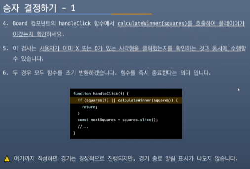

# 허동민 학번: 202130435


## 5월 8일 10주차

### React로 사고하기
- React를 사용하게 되면 우리가 고려하고 있는 디자인이나 만들 앱들에 대한 생각을 바꿀 수 있습
니다.
- React로 사용자 인터페이스를 빌드할 때, 먼저 이를 컴포넌트라는 조각으로 나눕니다.
- 그리고 각 컴포넌트의 다양한 시각적 상태들을 정의합니다.
- 마지막으로 컴포넌트들을 연결하여 데이터가 그 사이를 흘러가게 합니다.
- 이 자습서에서는 React로 검색할 수 있는 '상품 테이블을 만드는 과정을 체계적으로 안내해 드리 겠습니다.
- #React는 component 기반으로 개발 합니다. 이 번 장을 통해서 component의 조각 들이 어떻게 App으로 완성되는지 다시 한번 확인해 보세요.   

### 모의 시안과 함께 시작하기 1
- 이미 JSON API와 디자이너로부터 제공받은 모의 시안이 있다고 생각해 봅시다.
- JSON API는 아래와 같은 형태의 데이터를 반환합니다.

``` JSON API
[
  { category: "Fruits", price: "$1", stocked: true, name: "Apple" }, 
  { category: "Fruits", price: "$1", stocked: true, name: "Dragonfruit" },
  { category: "Fruits", price: "$2", stocked: false, name: "Passionfruit" }, 
  { category: "Vegetables", price: "$2", stocked: true, name: "Spinach" }, 
  { category: "Vegetables", price: "$4", stocked: false, name: "Pumpkin" }, 
  { category: "Vegetables", price: "$1", stocked: true, name: "Peas" }
]
```

###  모의 시안과 함께 시작하기 2
- 모의 시안은 다음과 같이 생겼습니다.

- React로 UI를 구현하기 위해서 일반적으로 다섯 가지 단계를 거칩니다.

### Step 1: UI를 컴포넌트 계층으로 쪼개기
- 먼저 모의 시안에 있는 모든 컴포넌트와 하위 컴포넌트 주변에 박스를 그리고, 그들에게 이름을 붙이면서 시작해 보세요.
- 디자이너와 함께 일한다면 그들이 이미 디자인 툴을 통하여 이 컴포넌트들에 이름을 정해 두었을
수도 있습니다. 한번 여쭤보세요!
- 어떤 배경을 가지고 있냐에 따라, 디자인을 컴포넌트로 나누는 방법에 대한 관점이 달라질 수 있 습니다.
- Programming : 새로운 함수나 객체를 만드는 방식과 같은 방법으로 해봅시다.
  - 이 중 단일책임 원칙을 반영하고자 한다면 컴포넌트는 이상적으로는 한 번에 한 가지 일만 해
야 합니다.
  - 만약 컴포넌트가 점점 커진다면 작은 하위 컴포넌트로 쪼개져야 하겠죠.
- CSS: 클래스 선택자를 무엇으로 만들지 생각해 봅시다. (실제 컴포넌트들은 약간 좀 더 세분되 어 있습니다.)
- Design : 디자인 계층을 어떤 식으로 구성할 지 생각해 봅시다.

### Step 1: UI를 컴포넌트 계층으로 쪼개기
- JSON이 잘 구조화 되어 있다면, 종종 이것이 UI의 컴포넌트 구조가 자연스럽게 데이터 모델에 대응된다는 것을 발견할 수 있습니다.
- 이는 UI와 데이터 모델은 보통 같은 정보 아키텍처, 즉 같은 구조를 가지기 때문입니다.
- UI를 컴포넌트로 분리하고, 각 컴포넌트가 데이터 모델에 매칭될 수 있도록 하세요.
- 여기 다섯 개의 컴포넌트가 있습니다.

### Step 1: UI를 컴포넌트 계층으로 쪼개기
1. FilterableProductTable(회색): 예시 전체를 포괄합니다.
2. SearchBar(파란색): 사용자의 입력을 받습니다.
3. ProductTable(라벤더색): 데이터 리스트를 보여주고, 사용자의 입력을 기반으로 필터링합니다.
4. ProductCategoryRow(초록색): 각 카테고리의 헤더를 보여줍니다.
5. ProductRow(노란색): 각각의 제품에 해당하는 행을 보여줍니다.


### Step 1: UI를 컴포넌트 계층으로 쪼개기
- ProductTable을 보면 "Name"과 "Price" 레이블을 포함한 테이블 헤더 기능만을 가진 컴포넌트는 없습니다.
- 독립된 컴포넌트를 따로 생성할 지 생성하지 않을지는 당신의 선택입니다.
- 이 예시에서는 3.ProductTable에 있는 단순한 헤더들이 ProductTable의 일부이기 때문에 위 레이블들을 컴포넌트로 만들지 않고 그냥 남겨두었습니다.
- 그러나 이 헤더가 복잡해지면 (즉 정렬을 위한 기능을 추가하는 등) ProductTableHeader 컴포 넌트를 만드는 것이 더 합리적일 것입니다.
- 이제 모의 시안 내의 컴포넌트들을 확인했으니, 이들을 계층 구조로 정리해 봅시다.
- 모의 시안에서 한 컴포넌트 내에 있는 다른 컴포넌트는 계층 구조에서 자식으로 표현됩니다.


### Step 2: React로 정적인 버전 구현하기
- 이제 컴포넌트 계층구조가 만들어졌으니, 앱을 실제로 구현해 볼 시간입니다.
- 가장 쉬운 접근 방법은 상호작용 기능은 아직 추가하지 않고, 데이터 모델로부터 UI를 렌더링하 는 버전을 만드는 것입니다.
- 대체로 먼저 정적인 버전을 만들고 상호작용 기능을 추가하는 게 더 쉽습니다.
- 정적 버전을 만드는 것은 많은 타이핑이 필요하지만, 생각할 것은 적습니다.
- 반대로 상호작용 기능을 추가하는 것은 많은 생각이 필요하지만, 타이핑은 그리 많이 필요하지
않습니다.
- 데이터 모델을 렌더링하는 앱의 정적인 버전을 만들기 위해서는
  - 다른 컴포넌트를 재사용하고,
  - props를 이용하여 데이터를 넘겨주는 컴포넌트를 구현하는 것이 좋습니다.
- props는 부모가 자식에게 데이터를 넘겨줄 때 사용할 수 있는 방법입니다.

### Step 2: React로 정적인 버전 구현하기
- 혹시 state 개념에 익숙하다고 해도 정적인 버전을 만드는 데는 state를 쓰지 마세요! 
- state는 오직 상호작용을 위해, 즉 시간이 지남에 따라 데이터가 바뀌는 것에 사용합니다. 
- 우리는 앱의 정적 버전을 만들고 있기 때문에 지금은 필요하지 않습니다.
- 앱을 만들 때 계층 구조에 따라 상층부에 있는 컴포넌트 즉, 1. FilterableProductTable부터 시작하는 하향식(top-down)으로 만드는 방법이 있습니다.
- 또는 하층부에 있는 컴포넌트인 5. ProductRow)부터 상향식(bottom-up)으로 만들 수도 있습니다.
- 간단한 예시에서는 보통 하향식으로 만드는 게 쉽지만, 프로젝트가 커지면 상향식으로 만들고 테 스트를 작성하면서 개발하기가 더 쉽습니다.
- #공식 문서의 첫 번째 코드는 state를 사용하기 전 완성된 코드입니다. 천천히 component 하나씩 완성해 봅니다.

### Step 2: React로 정적인 버전 구현하기
- 이 단계가 끝나면 데이터 렌더링을 위해 만들어진 재사용 가능한 component들의 라이브러리를 가지게 됩니다.
- 현재는 앱의 정적 버전이기 때문에 component는 단순히 JSC만 리턴합니다.
- 계층구조의 최상위 component(FilterableProductTable)는 prop으로 데이터 모델을 받습니다.
- 이는 데이터가 최상위 component부터 트리의 맨 아래까지 흘러가기 때문에 단방향 데이터 흐름이라고 부릅니다.
- 주의하세요! 여기까지는 아직 state값을 쓰지 마세요. 다음 단계에서 사용할 겁니다!

### Step2에 있는 component 구현하기
1. Project를 새로 생성하거나, 초기 commit으로 switch하여 실행에 이상이 없는지 확인합니다.
2. src/ 아래 필요 없는 파일을 제거합니다. (logo.svg / setupTest.js)
3. App.js에 있는 코드를 모두 삭제합니다.
4. 먼저 다음 코드로 App.js가 정상적으로 동작하는지 확인합니다.

5. 사용할 데이터 PRODUCTS를 적당한 위치에 작성합니다.
여기에서는 제일 아래에 작성 하도록 하겠습니다.
6. 다음으로 FilterableProductTable component를 만듭니다.

### stap2에 있는 component 구현하기
7. SearchBar ProductTable component.
8. 다음으로 ProductCategoryRow와 ProductRow를 작성합니다.
9. 마지막으로 처음에 수정한 App component를 다시 수정합니다.
10. 공식 문서의 출력과 동일하게 출력하는지 확인합니다.

### Step 3: 최소한의 데이터만 이용해서 완벽하게 UI State 표현하기
- UI를 상호작용(interactive)하게 만들려면, 사용자가 기반 데이터 모델을 변경할 수 있게 해야 합니다.
- React는 state를 통해 기반 데이터 모델을 변경할 수 있게 합니다.
- state는 앱이 기억해야 하는, 변경할 수 있는 데이터의 최소 집합이라고 생각하세요. state를 구조화 하는데 가장 중요한 원칙은 중복배제원칙(Don't Repeat Yourself)입니다.
- 애플리케이션이 필요로 하는 가장 최소한의 state를 파악하고, 나머지 모든 것들은 필요에 따라 실시간으로 계산하세요.
- 예를 들어, 쇼핑 리스트를 만든다고 하면 당신은 배열에 상품 아이템들을 넣을 겁니다.
- UI에 상품 아이템의 개수를 노출하고 싶다면, 상품 아이템 개수를 따로 state 값으로 가지는 게 아니라 단순하게 배열의 길이만 쓰면 됩니다.

### Step 3: 최소한의 데이터만 이용해서 완벽하게 UI State 표현하기
- 예시 애플리케이션 내 데이터들을 생각해 봅시다. 애플리케이션은 다음과 같은 데이터를 가지고 있습니다.
1. 제품의 원본 목록
2. 사용자가 입력한 검색어
3. 체크박스의 값
4. 필터링된 제품 목록

- 이 중 어떤 것이 state가 되어야 할까요? 아래의 세 가지 질문을 통해 결정할 수 있습니다.
1. 시간이 지나도 변하지 않나요? 그러면 확실히 state가 아닙니다.
2. 부모로부터 props를 통해 전달됩니까? 그러면 확실히 state가 아닙니다.
3. 컴포넌트 안의 다른 state나 props를 가지고 계산 가능한가요? 그렇다면 절대로 state가 아  닙니다!
- 이 외 남는 건 아마 state일 겁니다.

## 4월 18일 9주차(5월 1일 대체보강)

### 한 번 더 state 끌어올리기
6. 다음 플레이어와 플레이 기록을 추적하기 위해 Game 컴포넌트에 몇 개의 state를 추가하세요.

```js
export default function Game() {
const [xIsNext, setxIsNext] - useState(true);
const [history, setHistory] - usestate([Array(9).fill(null)]);
```
7. 현재 플레이에 대한 square을 렌더링하려면 history에서 마지막 squares의 배열을 읽어야 합니다.
8. 렌더링 중에 계산할 수 있는 충분한 정보가 이미 있으므로 usestate는 필요하지 않습니다.

```js
export default function Game() {
const [xIsNext, setXIsNext]-useState(true);
const [history, setHistory]-usestate([Array(1).fill(null)]);
const currentsquares - history[history.length - 1];
// ...
```

### 한 번 더 state 끌어올리기
9. 다음으로 Game 컴포넌트 안의 Board 컴포넌트가 게임을 업데이트할 때 호출할 handlePlay 함수를 만드세요.
10. xIsNext, currentSquares, handlePlay 를 Board 컴포넌트에 | props로 전달하세요.
```js
export default function Game() {
  const [xIsNext, setXIsNext] = useState(true);
  const [history, setHistory] = useState([Array(9).fill(null)]);
  const currentSquares - history[history.length-1];
  function handlePlay (nextSquares) {
    // TODO
  }
  return (
    <div className="game">
      <div className="game-board">
        <Board xIsNext={xIsNext} squares={currentSquares} onPlay={handlePlay} />
        // ...
  )
}
```

### 한 번 더 state 끌어올리기
- Board 컴포넌트가 props에 의해 완전히 제어되도록 만들겠습니다.
11. Board 컴포넌트가 xIsNext, squares, onPlay 함수를 props로 받을 수 있도록 변경합니다. - onPlay는 Board가 업데이트된 squares를 배열로 호출할 수 있는 새로운 함수입니다.
12. 다음으로 Board 함수에서 useState를 호출하는 처음 두 줄을 제거하세요.
```js
function Board({ xIsNext, squares, onPlay }) {
  function handleClick(i) {
    //...
  }
  // ...
}
```
13. 이제 Board 컴포넌트의 handleClick에 있는 setSquares 및 setXIsNext 호출을 새로운 onPlay 함수에 대한 단일 호출로 대체함으로써 사용자가 사각형을 클릭할 때 Game 컴포넌트가 Board를 업데이트할 수 있습니다.

```js
 if (xIsNext) {
      nextSquares[i] = "X";
    } else {
      nextSquares[i] = "O";
    }
    onPlay(nextSquares);
```

### 한번 더 state 끌어올리기
- Board 컴포넌트는 Game 컴포넌트가 전달한 props에 의해 완전히 제어됩니다.
- 게임이 다시 작동하게 하려면 Game 컴포넌트에서 handlePlay 함수를 구현해야 합니다.
- handlePlay가 호출되면 무엇을 해야 할까요?
  - → 이전의 Board는 업데이트된 setSquares를 호출했지만, 이제는 업데이트된 squares 배열을 onPlay로 전달한다는 걸 기억하세요.
- handlePlay 함수는 리렌더링을 트리거하기 위해 Game의 state를 업데이트해야 하지만, 더 이상 호출할 수 있는 setSquares 함수가 없습니다.
- 대신 이 정보를 저장하기 위해 history state 변수를 사용하고 있습니다.
- 업데이트된 squares 배열을 새 히스토리 항목으로 추가하여 history를 업데이트해야 하고, Board에서 했던 것처럼 xIsNext 값을 반전시켜야 합니다. 

``` js
export default function Game() {
  //...
  function handlePlay(nextSquares) {
    setHistory([...history, nextSquares]);
    setXIsNext(!xIsNext);
  }
  //...
}
```

### 한 번 더 state 끌어올리기
- 앞에서 [...history, nextSquares] 는 history에 있는 모든 항목을 포함하는 새 배열을 만들고 그 뒤에 nextSquares를 만듭니다.
- ....history 전개 구문을 사용하면 history 의 모든 항목 열거'로 읽을 수 있습니다.
- 예를 들어, history가 [[null, null, null], ["x", null, null]]이고 nextSquares 가 ["X", null, "o"]라면 새로운 [...history, nextSquares] 배열은 [[null, null, null], ["x", null, null], ["X", null, "o"]]가 될 것입니다.  

- 이 시점에서 state를 Game 컴포넌트로 옮겼으므로 리팩토링 전과 마찬가지로 UI가 완전히 작동 해야 합니다.

- ● 전개 연산자(spread operator)...
+++ 리액트 공부하면서 자바스크립트 구문 mdn web docs로 찾아보기
Typescript 자바스크립트 대신에 공부하기

### 화면이 한 줄로 깨져서 보이는 이유
- 화면이 다음과 같이 한 줄로 깨져서 보이는 경우가 있습니다.
- 이 것은 Square 컴포넌트에서 <button> <div>로 감싸서 생기는 문제 입니다.
- React Fragment(>...</>)로 감싸거나, <button>만 남겨 주세요.
- React Fragment를 사용하면 구조도 깔끔하고, 유지 보수도 편합니다.
- 우리가 사용하는 튜토리얼에서는 버튼들을 float 스타일로 정렬하고 있습니다.
- 그런데 float: left는 <button>끼리만 제대로 정렬되도록 스타일이 짜여 있습니다.


### 과거 움직임 보여주기
이제 틱택토 게임의 히스토리를 기록하기 때문에, 플레이어에게 과거 플레이 목록을 보여줄 수 있습니다.
- <button>과 같은 React 엘리먼트는 일반 JavaScript 객체이므로 애플리케이션에서 전달할 수 있습니다.
- React에서 여러 엘리먼트를 렌더링하려면 React 엘리먼트 배열을 사용할 수 있습니다.
- 이미 state에 이동 history 배열이 있기 때문에 이것을 React 엘리먼트 배열로 변환해야 합니 다.
- JavaScript에서 한 배열을 다른 배열로 변환하려면 배열 map 메서드를 사용하면 됩니다.
```
 [1, 2, 3].map((x)→x*2)// [2, 4, 6]
```
1. 플레이 history 배열을 화면의 버튼을 나타내는 React 엘리먼트로 변환합니다.
2. 과거의 플레이로 "점프할 수 있는 버튼 목록을 표시하세요.
3. 이 것을 구현하기 위해서 Game 컴포넌트에서 history를 map을 이용해보겠습니다.

### 과거 움직임 보여주기
- 콘솔에 다음과 같은 오류 메시지가 표시되어야 합니다:

```js
 function jumpTo(nextMove) {
    // TODO
  }

  const moves = history.map((squares, move) => {
    let description;
    if (move > 0) {
      description = 'Go to move #' + move;
    } else {
      description = 'Go to game start';
    }
    return (
      <li>
        <button onClick={() => jumpTo(move)}>{description}</button>
      </li>
    );
  });

   return (
    <div className="game">
      <div className="game-board">
        <Board xIsNext={xIsNext} squares={currentSquares} onPlay={handlePlay} />
      </div>
      <div className="game-info">
        <ol>{moves}</ol>
      </div>
    </div>
  );
}
```

```js
export default function Game() {
  const [xIsNext, setXIsNext] = useState(true);
  const [history, setHistory] = useState([Array(9).fill(null)]);
  const currentSquares = history[history.length - 1];

  function handlePlay(nextSquares) {
    setHistory([...history, nextSquares]);
    setXIsNext(!xIsNext);
  }

  function jumpTo(nextMove) {
    // TODO
  }
}
```

* 경고: 배열 또는 반목자의 각 자식 요소는 고유한 "key" 속성을 가져야 합니다. 'Game'의 렌더 메서드를 확인하세요.

### map 함수의 사용
- #문서의 내용이 이해하기 어렵게 번역되어 있기 때문에 다시 정리합니다.
```
const moves history.map((squares, move)> { }
```
- map의 기본 구문은 map(callbackFn) 혹은 map(callbackFn, thisArg) 입니다.
- thisArg는 내부에서 this로 사용할 값을 지정하는데 화살표 함수에서는 생략됩니다.
- 따라서 예제에서는 callbackFn만 사용하고, 화살표 함수가 callback 함수를 대신합니다.
- squares, move는 화살표 함수의 매개변수 입니다.
1. history.map: history는 모든 플레이를 저장하는 배열입니다. 이 history에 map 함수를 적용 한다는 의미 입니다.
2. map 함수는 history 각각의 요소 index를 순회하면서 squares 추출합니다.
3. 각 요소는 { }안의 실행문을 실행하면서 버튼을 생성합니다.
4. 이렇게 생성된 버튼은 moves 객체(배열)에 다시 저장됩니다.
5. move는 최종 rendering에 사용됩니다.

### map함수의 사용-2
```
const moves history.map((squares, move) => { }
```
- 다시 정리하면
  - 원본 배열 (history): map이 호출된 원본 배열.
  - 원본 배열의 인덱스 (move): 현재 순환 중인 원본 배열 요소의 인덱스. 
  - 요소 값 (squares): 현재 순회 중인 요소 배열의 값.
- history.map((squares, move) => { ... })는 다음과 같이 동작합니다. 
  - 첫 번째 호출: squares[null, null, null, null, null, null, null, null, null], move=0
  - 두번째 호출: squares=['x', null, null, null, null, null, null, null, null], move=1 
  - 세 번째 호출: squares=['x', '0', null, null, null, null, null, null, null], move=2
- 각각의 history 요소에 대한 { }의 실행문(후작업) 실행합니다.
- moves 객체에 저장합니다.
- 최종 출력에 사용합니다.

### 과거 움직임 보여주기
6. 틱택토 게임 history의 각 플레이에 대해 버튼 <button>이 포함된 목록 <li>를 생성하세요.
7. 버튼에는 아직 구현하지 않은 jumpTo라는 함수를 호출하는 onclick 핸들러가 있습니다.
- 현재는 콘솔에 게임의 동작 목록과 함께 오류가 표시됩니다.
- "key" 오류가 무엇을 의미하는지 알아보겠습니다.


### Key 선택하기-1
- 리스트를 렌더링할 때 React는 렌더링 된 각 리스트 항목에 대한 몇 가지 정보를 저장합니다.
- 리스트를 업데이트할 때 React는 무엇이 변경되었는지 확인해야 합니다.
- 리스트의 항목은 추가, 제거, 재정렬 또는 업데이트될 수 있습니다.
- 리스트가 다음과 같이 업데이트가 되었다고 생각해 봅니다.

- 아마 task의 개수가 업데이트 되었을 뿐만 아니라 Alexa와 Ben의 순서가 바뀌고 Claudia가 두 사람 사이에 추가되었다고 생각할 것입니다.
- 그러나 React는 컴퓨터 프로그램이므로 우리가 의도한 바가 무엇인지 알지 못합니다.
- 그러므로 리스트의 항목에 key 프로퍼티를 지정하여 각 리스트의 항목이 다른 항목과 다르다는 것을 구별해 주어야 합니다.

### Key 선택하기-2
- 만약 데이터베이스에서 데이터를 불러와서 사용한다면 Alexa, Ben, Claudia의 데이터베이스 ID 를 key로 사용할 수 있습니다.

- 리스트가 다시 렌더링 되면 React는 각 리스트 항목의 key를 가져와서 이전 리스트의 항목에서 일치하는 key를 탐색합니다.
- 현재 리스트에서 이전에 존재하지 않았던 key가 있으면 React는 컴포넌트를 생성합니다.
- 만약 현재 리스트에 이전 리스트에 존재했던 key를 가지고 있지 않다면 React는 그 key를 가진 컴포넌트를 제거합니다.
- 두 key가 일치한다면 해당 컴포넌트는 이동합니다.
- key는 각 React가 각 컴포넌트를 구별할 수 있도록 하여, 컴포넌트가 다시 렌더링 될 때 React 가 해당 컴포넌트의 state를 유지할 수 있게 합니다.
- 컴포넌트의 key가 변하면 컴포넌트는 제거되고 새로운 state와 함께 다시 생성됩니다.

### Key 선택하기-3
- key는 React에서 특별하게 미리 지정된 프로퍼티입니다.
- 엘리먼트가 생성되면 React는 key 프로퍼티를 추출하여 반환되는 엘리먼트에 직접 key를 저장합니다.
- key가 props로 전달되는 것처럼 보일 수 있지만, React는 자동으로 key를 사용해 업데이트할 컴포넌트를 결정합니다.
- 부모가 지정한 key가 무엇인지 컴포넌트는 알 수 없습니다.
- 동적인 리스트를 만들 때마다 적절한 key를 할당하는 것을 강력하게 추천합니다.
- 적절한 key가 없는 경우 데이터의 재구성을 고려해 보세요.
- key가 지정되지 않은 경우, React는 경고를 표시하며 배열의 인덱스를 기본 key로 사용합니다.
- 배열 인덱스를 key로 사용하면 리스트 항목의 순서를 바꾸거나 항목을 추가/제거할 때 문제가 발생합니다.
- 명시적으로 key={i}를 전달하면 경고는 사라지지만 배열의 인덱스를 사용할 때와 같은 문제가 발생하므로 대부분은 추천하지 않습니다.
- key는 전역적으로 고유할 필요는 없으며, 컴포넌트와 해당 컴포너늩의 형제 컴포넌트 사이에서만 고유하면 됩니다. 

### 시간여행 구현하기 - 1
- 틱택토 게임의 기록에서 과거의 각 플레이에는 해당 플레이의 일련번호인 고유 ID가 있습니다.
- 플레이는 중간에 순서를 바꾸거나 삭제하거나 삽입할 수 없기 때문에 플레이 인덱스를 key로 사 용하는 것이 안전합니다.

1. Game 함수에서 <li_key={move}>로 key를 추가할 수 있으며, 렌더링 된 게임을 다시 로드하면 React의 "key" 에러가 사라질 것입니다.
```js
const moves = history.map((squares, move) => {
  //...
  return (
    <li key={move}>
      <button onClick={() => jumpTo(move)}>{description}</button>
    </li>
  );
});
```

### 시간여행 구현하기 - 2
- jumpTo를 구현하기 전에 사용자가 현재 어떤 단계를 보고 있는지를 추적할 수 있는 Game 컴포넌트의 state가 하나 더 필요합니다.
1. 이를 위해 초기값이 0인 currentMove 라는 새 state 변수를 정의하세요.
```js
export default function Game() {
  const [xIsNext, setXIsNext] = useState(true);
  const [history, setHistory] = useState([Array(9).fill(null)]);
  const [currentMove, setCurrentMove] = useState(0);
  const currentSquares = history[history.length - 1];
  //...
}
```
2. 다음으로 Game 내부의 jumpTo 함수를 수정해서, 해당 currentMove를 업데이트하세요.
3. 또한 currentMove를 변경하는 숫자가 짝수면 xIsNext를 true로 설정하세요.
```js
export default function Game() {
  // ...
  function jumpTo(nextMove) {
    setCurrentMove(nextMove);
    setXIsNext(nextMove % 2 === 0);
  }
  //...
}
```
- #여기까지만 하면 내부적으로는 동작하지만 렌더링은 안되는 상태입니다.

### 시간여행 구현하기 - 2
6. 마지막으로 항상 마지막 동작을 렌더링하는 대신 현재 선택한 동작을 렌더링하도록 Game 컴포넌트를 수정하겠습니다.
```js
export default function Game() {
  const [xIsNext, setXIsNext] = useState(true);
  const [history, setHistory] = useState([Array(9).fill(null)]);
  const [currentMove, setCurrentMove] = useState(0);
  const currentSquares = history[currentMove];

  // ...
}
```
- 게임 히스토리의 특정 단계를 클릭하면 틱택토 보드가 즉시 업데이트되어 해당 단계가 발생한 시점의 보드 모양이 표시됩니다.

### 최종 정리
- 코드를 자세히 살펴보면 currentMove가 짝수일 때는 xIsNext === true가 되고, currentMove가 홀수일 때는 xIsNext == false가 되는 것을 알 수 있습니다.
- 즉, current Move의 값을 알고 있다면 언제나 xIsNext가 무엇인지 알아낼 수 있습니다.

- 따라서 이 두 가지 state를 모두 저장할 이유가 없습니다.
- 항상 중복되는 state는 피하세요.
- state에 저장하는 것을 단순화하면 버그를 줄이고 코드를 더 쉽게 이해할 수 있습니다.
- Game을 변경하여 더 이상 xIsNext를 별도의 state 변수로 저장하지 않고 currentMove를 기반으로 알아내도록 수정하겠습니다.

### 최종 정리
- 더 이상 xIsNext state 선언이나 setXIsNext 호출이 필요하지 않습니다.
- 이제 컴포넌트를 코딩하는 동안 실수를 하더라도 xIsNext가 currentMove와 동기화되지 않을 가능성이 없습니다.
```js
export default function Game() {
  const [history, setHistory] = useState([Array(9).fill(null)]);
  const [currentMove, setCurrentMove] = useState(0);
  const xIsNext = currentMove % 2 === 0;
  const currentSquares = history[currentMove];

  function handlePlay(nextSquares) {
    const nextHistory = [...history.slice(0, currentMove + 1), nextSquares];
    setHistory(nextHistory);
    setCurrentMove(nextHistory.length - 1);
  }

  function jumpTo(nextMove) {
    setCurrentMove(nextMove);
  }
  // ...
}
```

### 향후 과제
- 시간이 남거나 새로운 React 기술을 연습하고 싶다면 아래에 틱택토 게임을 개선할 수 있는 몇 가지 아이디어가 있습니다. 아이디어는 난이도가 낮은 순으로 정렬되어 있습니다.
1. 현재 이동에 대해서만 버튼 대신 '당신은 #번째 순서에 있습니다."를 표시해 보세요.
2. Board를 하드 코딩 하는 대신 두 개의 루프를 사용하여 사각형을 만들도록 다시 작성해 보세요.
3. 동작을 오름차순 또는 내림차순으로 정렬할 수 있는 토글 버튼을 추가해 보세요.
4. 누군가 승리하면 승리의 원인이 된 세 개의 사각형을 강조 표시해 보세요. (아무도 승리하지 않 으면 무승부라는 메시지를 표시하세요.)
5. 이동 히스토리 목록에서 각 이동의 위치를 형식(열, 행)으로 표시해 보세요.  

- 이 자습서를 통해 엘리먼트, 컴포넌트, props, state를 포함한 React의 개념에 대해 살펴봤습 니다. 이제 이러한 개념이 게임을 만들 때 어떻게 작동하는지 보았으니, React로 사고하기를 통 해 앱의 UI를 만들 때 동일한 React 개념이 어떻게 작동하는지 확인해 보세요.


## 4월 17일 7주차

### state 끌어올리기
- handleClick 함수는 JavaScript의 slice() 배열 메서드를 사용하여 squares 배열의 사본인 nextSquares를 생성합니다. (참고 : [developer.mozilla.org](https://developer.mozilla.org/ko/docs/Web/JavaScript/Reference/Global_Objects/Array/slice))

``` js
const animals = ["ant", "bison", "camel", "duck", "elephant"];

console.log(animals.slice(2));
// Expected output: Array ["camel", "duck", "elephant"]

console.log(animals.slice(2, 4));
// Expected output: Array ["camel", "duck"]

console.log(animals.slice(1, 5));
// Expected output: Array ["bison", "camel", "duck", "elephant"]

console.log(animals.slice(-2));
// Expected output: Array ["duck", "elephant"]

console.log(animals.slice(2, -1));
// Expected output: Array ["camel", "duck"]

console.log(animals.slice());
// Expected output: Array ["ant", "bison", "camel", "duck", "elephant"]
```

- 그 다음 handleClick 함수는 nextSquares 배열의 첫 번째 Squares(index [0])에 X를 추가하여 업데이트합니다.
- setSquares 함수를 호출하면 React는 컴포넌트의 state가 변경되었음을 알 수 있습니다.
- 그러면 squares의 state를 사용하는 컴포넌트(Board)와 그 하위 컴포넌트(보드를 구성하는 Square 컴포넌트)가 다시 렌더링 됩니다.

- 중요 합니다! : #이 설명은 문서의 코드 중 Board가 Square를 포함하고 있음을 전재.
- JavaScript는 클로저를 지원하기 때문에 내부 함수가(예: handleClick) 외부 함수(예: Board) 에 정의된 변수 및 함수에 접근할 수 있습니다.
- handleClick 함수는 squares의 state를 읽고 setSquares 메서드를 호출할 수 있는데, 이 두 함수는 Board 함수 내부에 정의되어 있기 때문입니다.


### Closure의 개념
- 클로저의 핵심은 스코프를 이용하여 변수의 접근 범위를 '폐쇄'하는 것에 있습니다.
- 외부 함수 스코프에서 내부 함수 스코프로 접근이 불가능합니다.
- 내부 함수에서는 외부 함수 스코프에서 선언된 변수에 접근이 가능합니다.

- 장점
1. 전역변수 사용의 최소화
2. 데이터 보존 가능 (폐쇄성)
3. 모듈화를 통한 코드 재사용에 편리
4. 정보의 접근 제한 (캡슐화)

### state 끌어올리기-2
- 이제 보드에 X를 추가할 수 있게 되었지만 가능한 건 오직 왼쪽 위 Square 입니다.
- handleClick 함수는 왼쪽 위 Square(index 0)만 업데이트하도록 하드 작성되어 있습니다.
- 모든 사각형을 업데이트할 수 있도록 handleClick 함수를 수정하겠습니다.
9. handleClick 함수에 업데이트할 Square의 index를 나타내는 인수 i를 추가하세요.
```js
export default function Board() {
  const (squares, setsquares) usestate(Array()).fill(null));
  function handleClick(1) {
    const nextsquares - squares.slice();
    nextSquares[1] = "x";
    setsquares (nextsquares);
  }
  return (
    // ...
  )
}
```

### state 끌어올리기 - 3
- 다음으로 인수 is handleClick에 전달해야 합니다.
- Square의 onSquareClick prop를 아래와 같이 JSX에서 직접 handleClick(0)으로 설정할 수도 있지만, 이 방법은 작동하지 않습니다.
```js
<Square value-(squares[0]} onsquareClick"(handleClick(1)} />
```
- 그 이유는 다음과 같습니다.
- handleClick(0) 호출은 Board 컴포넌트 렌더링의 일부가 됩니다.
- handleClick(0)은 setSquares를 호출하여, Board 컴포넌트의 state를 변경하기 때문에 Board 컴포넌트 전체가 다시 렌더링 됩니다.
- 하지만 이 과정에서 handleClick(0)은 다시 실행되기 때문에 무한 루프에 빠지게 됩니다.

Too many re-renders. React limits the number of renders to prevent an infinite loop.

### state 끌어올리기 - 3
- 하지만 9개의 서로 다른 함수를 정의하고 각각에 이름을 붙이는 것은 너무 복잡합니다.
10. 대신 이렇게 해보겠습니다.
```js
export default function Board() { 
  // ...
  return (
  <>
    <div className="board-row">
      <square value(squares[0]} onsquareclick"(()> handleClick(0)}/>
      // ...
  );
}
```
- 새로운 문법()>에 주목하세요.
- 여기서 () handleClick(0)은 화살표 함수로, 함수를 짧게 정의하는 방법입니다.
- Square가 클릭 되면 => "화살표" 뒤의 코드가 실행되어 handleClick(0)을 호출합니다.
- handleClick(0) 함수를 화살표 함수가 호출하고, 화살표 함수를 Square에 전달하는 것입니다.

### State 끌어올리기 -4
11. 이제 전달한 화살표 함수에서 handleClick을 호출하도록 나머지 8개의 Square 컴포넌트를
수정해야 합니다.
```js
export default function Board() {
  // ...
  return (
    <>
      <div className="board-row">
        <Square value={squares[0]} onSquareClick={() => handleClick(0)} />
        <Square value={squares[1]} onSquareClick={() => handleClick(1)} />
        <Square value={squares[2]} onSquareClick={() => handleClick(2)} />
      </div>
      <div className="board-row">
        <Square value={squares[3]} onSquareClick={() => handleClick(3)} />
        <Square value={squares[4]} onSquareClick={() => handleClick(4)} />
        <Square value={squares[5]} onSquareClick={() => handleClick(5)} />
      </div>
      <div className="board-row">
        <Square value={squares[6]} onSquareClick={() => handleClick(6)} />
        <Square value={squares[7]} onSquareClick={() => handleClick(7)} />
        <Square value={squares[8]} onSquareClick={() => handleClick(8)} />
      </div>
    </>
  );
};
```

### state 끌어올리기
이제 보드의 사각형을 클릭하여 X를 다시 추가할 수 있습니다.

보드를 X로 채우기
하지만 이번에는 모든 state 관리가 사각형이 아닌 Board 컴포넌트에서 처리됩니다!

코드는 다음과 같습니다.
```js
import { useState } from 'react';

function Square({ value, onSquareClick }) {
  return (
    <button className="square" onClick={onSquareClick}>
      {value}
    </button>
  );
}

export default function Board() {
  const [squares, setSquares] = useState(Array(9).fill(null));

  function handleClick(i) {
    const nextSquares = squares.slice();
    nextSquares[i] = 'X';
    setSquares(nextSquares);
  }

  return (
    <>
      <div className="board-row">
        <Square value={squares[0]} onSquareClick={() => handleClick(0)} />
        <Square value={squares[1]} onSquareClick={() => handleClick(1)} />
        <Square value={squares[2]} onSquareClick={() => handleClick(2)} />
      </div>
      <div className="board-row">
        <Square value={squares[3]} onSquareClick={() => handleClick(3)} />
        <Square value={squares[4]} onSquareClick={() => handleClick(4)} />
        <Square value={squares[5]} onSquareClick={() => handleClick(5)} />
      </div>
      <div className="board-row">
        <Square value={squares[6]} onSquareClick={() => handleClick(6)} />
        <Square value={squares[7]} onSquareClick={() => handleClick(7)} />
        <Square value={squares[8]} onSquareClick={() => handleClick(8)} />
      </div>
    </>
  );
}
```

### state 끌어올리기
- 이제 Board가 모든 state를 관리하므로 부모 Board 컴포넌트는 자식 Square 컴포넌트가 올바르 게 표시될 수 있도록 props를 전달합니다.
- Square를 클릭하면 자식 Square 컴포넌트가 부모 Board 컴포넌트에 Board의 state를 업데이트하도록 요청합니다.
- Board의 state가 변경되면 Board 컴포넌트와 모든 자식 Square 컴포넌트가 자동으로 다시 렌더링 됩니다.
- Board 컴포넌트에 속한 모든 Square의 state를 유지하면 나중에 승자를 결정할 수 있습니다.

### state 끌어올리기
- 사용자가 Board의 왼쪽 위 사각형을 클릭하여 X를 추가하면 어떤 일이 발생하는지 다시 한번 정리해 보겠습니다.
1. 왼쪽 위 사각형을 클릭하면 button이 Square로부터 onClick prop으로 받은 함수가 실행됩니다.
  - Square 컴포넌트는 Board에서 해당 함수를 onSquareclick props로 받았습니다.
  - Board 컴포넌트는 JSX에서 해당 함수를 직접 정의했습니다.
  - 이 함수는 0을 인수로 handleClick을 호출합니다.
2. handleClick은 인수 0을 사용하여 squares 배열의 첫 번째 엘리먼트를 null에서 X로 업데이트 합니다.
3. Board 컴포넌트의 squares state가 업데이트되어 Board와 그 모든 자식이 다시 렌더링 됩니 다.
  - 이에 따라 인덱스가 0인 Square 컴포넌트의 value prop이 null에서 X로 변경됩니다.
4. 최종적으로 사용자는 왼쪽 위 사각형을 클릭한 후 비어 있는 사각형이 X로 변경된 것을 확인할 수 있습니다.

### state 끌어올리기
- !중요합니다!
- DOM <button> 엘리먼트의 onClick 어트리뷰트(속성)는 빌트인 컴포넌트이기 때문에 React에서 특별한 의미를 갖습니다.
- 사용자 정의 컴포넌트, 예를 들어 Square의 경우 이름은 사용자가 원하는 대로 지을 수 있습니다.
- Square의 onSquareclick prop나 Board의 handleClick 함수에 어떠한 이름을 붙여도 코드는 동일하게 작동합니다.
- React에서는 주로 이벤트를 나타내는 prop에는 onSomething과 같은 이름을 사용하고, 이벤트를 처리하는 함수를 정의 할 때는 handleSomething과 같은 이름을 사용합니다.

### 불변성이 왜 중요할까요
- handleClick에서 기존 배열을 수정하는 대신 slice()를 호출하여 squares 배열의 사본을 생성하는 방법에 주목하세요.
- 그 이유를 설명하기 위해 불변성과 불변성을 배우는 것이 중요한 이유에 대해 논의해 보겠습니다.

- 일반적으로 데이터를 변경하는 방법에는 두 가지가 있습니다.
1. 첫 번째 방법은 데이터의 값을 직접 변경하여 데이터를 변형 하는 것입니다.
2. 두 번째 방법은 원하는 변경 사항이 있는 새 복사본으로 데이터를 대체하는 것입니다.

- 다음은 squares 배열을 변형한 경우의 모습입니다. (직접 변경)
```js
const squares (null, null, null, null, null, null, null, null, null);
squares[0] = 'X'
// Now 'squares' is["x", null, null, null, null, null, null, null, null);
```

- 그리고 아래는 squares 배열을 변형하지 않고 데이터를 변경한 경우의 모습입니다. (복사 대체)
```js
const squares- [null, null, null, null, null, null, null, null, null];
const nextsquares['x', null, null, null, null, null, null, null, null];
// Now'squares' is unchanged, but 'nextsquares' first element is 'x' rather than 'null'
```

### 불변성이 왜 중요할까요
- 최종 결과는 같지만, 원본 데이터를 직접 변형하지 않음으로써 몇 가지 이점을 얻을 수 있습니다.

1. 불변성을 사용하면 복잡한 기능을 훨씬 쉽게 구현할 수 있습니다.
- 우리는 이 자습서의 뒷부분에서 게임의 진행 과정을 검토하고 과거 움직임으로 "돌아가기"를 할 수 있는 "시간 여행" 기능을 구현할 예정입니다.
- 특정 작업을 실행 취소하고 다시 실행하는 기능은 이 게임에만 국한된 것이 아닌 앱의 일반적인 요구사항입니다.
- 직접적인 데이터 변경을 피하면 이전 버전의 데이터를 그대로 유지하여 나중에 재사용(또는 초기화)할 수 있습니다.

### 불변성이 왜 중요할까요
2. 불변성을 사용하는 것의 또 다른 장점이 있습니다.
- 기본적으로 부모 컴포넌트의 state가 변경되면 모든 자식 컴포넌트가 자동으로 다시 렌더링 됩니다.
- 여기에는 변경 사항이 없는 자식 컴포넌트도 포함됩니다.
- 리렌더링 자체가 사용자에게 보이는 것은 아니지만, 성능상의 이유로 트리의 영향을 받지 않는 부분의 리렌더링을 피하는 것이 좋습니다.
- 불변성을 사용하면 컴포넌트가 데이터의 변경 여부를 저렴한 비용으로 판단할 수 있습니다.
- memo API 참고서에서 React가 컴포넌트를 다시 렌더링할 시점을 선택하는 방법에 대해 살펴볼 수 있습니다.

### 교대로 두기 - 1
- 현재까지 작성한 틱택토 게임에서 가장 큰 결함인 "0"를 보드에 표시할 수 없다는 문제를 수정할 차례입니다.

1. 첫 번째 선수가 두는 말을 "X"로 설정합니다. 이제 Board 컴포넌트에 또 다른 state를 추가하여 추적해 보겠습니다.
- X와 O가 번갈아 한 번씩 두어야 하기 때문에 X가 두었는지 아닌지 현재의 상태를 보관하면 됩니다. 즉, X의 차례면 true, 0의 차례면 false 상태로 기억하면 됩니다.
```js
function Board() {
  const (xIsNext, setxIsNext) usestate(true);
  const (squares, setsquares)-usestate(Array(9).fill(null));

  // ...
}
```
2. 플레이어가 움직일 때마다 다음 플레이어를 결정하기 위해 불리언 값인 xIsNext가 반전되고 게임의 state가 저장됩니다. Board의 handleClick 함수를 업데이트하여 xIsNext의 값을 반전시키세요.


### 교대로 두기 - 1
- 완성된 코드는 다음과 같습니다.
```js
export default function Board() { 
  const [xIsNext, setXIsNext]useState(true);
  const (squares, setsquares)-usestate(Array(9).fill(null));
  function handleClick(1) 
    const nextsquares-squares.slice(); 
    if (xisNext) {
      nextSquares[1] "x";
    } else {
      nextSquares[1] "0";
    }
    setSquares (nextSquares);
    setxisNext(IxIsNext);
    return (
      // ...
  );
}
```

- 개발자 도구에서 Board의 state를 확인해 보세요.


### 교대로 두기 - 2
- 이제 다른 사각형을 클릭하면 정상적으로 X와 O가 번갈아 표시됩니다!
- 하지만 다른 문제가 발생했습니다. 같은 사각형을 여러 번 클릭해 보세요.
- 0가 X를 덮어씌웁니다! 이렇게 하면 게임이 좀 더 흥미로워질 수 있지만 지금은 원래의 규칙을 유지하겠습니다.
- 지금은 X와 0로 사각형을 표시할 때 먼저 해당 사각형에 이미 X 또는 0값이 있는지 확인하고 있지 않습니다.
- 앞으로 돌아가서 이 문제를 해결하기 위해 사각형에 이미 X와 O가 있는지 확인하겠습니다.
1. square가 이미 채워져 있는 경우 Board의 state를 업데이트하기 전에 handleClick 함수에서 조기에 return 하겠습니다.
```js
function handleClick {
  if (squares[1]) {
    return;
  }
  const nextsquares-squares.slice();
  // ...
}
```
- 이제 빈 사각형에 X 또는 0만 추가할 수 있습니다!


### return의 의미
- 작성한 코드에는 return 값이 없습니다.
- JavaScript에서 return 값이 없는 return;은 함수를 즉시 종료하라는 의미입니다.
- 이때 값을 반환하지 않으면 자동으로 undefined를 반환합니다.
= squares[i]가 이미 값이 있다면(누군가 이미 둔 곳이라면), 그 자리에 다시 둘 수 없으니 아무일도 하지 말고 함수를 끝내는 것입니다.

### 승자 결정하기
- 이제 어느 플레이어의 다음 차례인지 표시했으니, 게임의 승자가 결정되어 더 이상 차례를 만들 필요가 없을 때도 표시해야 합니다.
- 이를 위해 9개의 사각형 배열을 가져와서 승자를 확인하고, 적절하게 'x', '0', 또는 null을 반환하는 도우미 함수 calculateWinner를 추가하겠습니다.
- calculateWinner 함수에 대해 너무 걱정하지 마세요. 이 함수는 React에서만 국한되는 함수가 아닙니다.
- [중요] calculateWinner 함수를 Board의 앞에 정의하든 뒤에 정의하든 상관없습니다. 여기에선 컴포넌트를 편집할 때마다 편집기 상에서 스크롤 할 필요가 없도록 마지막에 배치하겠습니다.

### 승자 결정하기 - 1
1. 먼저 승리할 수 있는 경우의 자리를 2차원 배열로 선언합니다.
2. 선언된 배열 line과 squares를 비교하기 위한 for문을 작성합니다.
3. 비교를 위해 구조 분해 할당을 합니다.
```js
export default function Board() {
  //...
}
function calculatewinner (squares) {
  const lines = [
    [0, 1, 2].
    [6, 7, 8],
    [0, 3, 6],
    [1, 4, 7].
    [2, 5, 8],
    [0, 4, 8],
    [2, 4, 6]
  ];
  for (let i = 0; i < Lines.length; i++) {
    const (a, b, c) = lines[1];
    if (squares[a] && squares[a] === squares[b] && squares[a] === square[c]) {   
      return squares[a];
    }
  }
  return null;
}
```
###  구조 분해 할당 (Destructuring Assignment)
- 비구조화 할당, 구조화 할당이라고도 번역되지만 구조 분해 할당을 많이 사용합니다.
- 구조화 분해 할당은 배열이나 객체의 구조를 해체하여 내부 값을 개별 변수에 쉽게 할당하는 방법 입니다.
- 이를 통해 코드의 간결성과 가독성을 높일 수 있습니다.
- map 함수에서도 사용되는 아주 많이 사용하는 방법입니다.

```js
const pairs =[
  [1, 2],
  [3, 4],
  [5, 6]
];
pairs.map(([x,y]) -> {
console.log('x: ${x}, y: ${x}');
});
```
^ 배열의 경우
```js
const users [
  (id: 1, name: "Alice" ),
  { id: 2, name: "Bob"}
];
users.map(({ id, name}) -> {
  console.log('${id}: {name}');
});
```
^ 객체의 경우

### 구조 분해 할당 (Destructuring Assignment)
- lines는 승리 할 수 있는 squares의 index 번호입니다.
- for문을 통해 lines의 길이 만큼 비교를 반복합니다.
- 구조 분해 할당을 통해 lines의 index를 a, b, c에 보관합니다.
- squares의 해당 index 값을 비교하여 3개가 모두 일치하면 값이 X인지 0인지를 return합니다.
- 일치하는 것이 없으면 null을 return합니다.
```js
function calculatewinner (squares) {
  const lines = [
    [0, 1, 2].
    [6, 7, 8],
    [0, 3, 6],
    [1, 4, 7].
    [2, 5, 8],
    [0, 4, 8],
    [2, 4, 6]
  ];
  for (let i = 0; i < Lines.length; i++) {
    const (a, b, c) = lines[1];
    if (squares[a] && squares[a] === squares[b] && squares[a] === square[c]) {   
      return squares[a];
    }
  }
  return null;
}
```

### 승자 결정하기 - 1
4. Board 컴포넌트의 handleClick 함수에서 calculateWinner(squares)를 호출하여 플레이어가 이겼는지 확인하세요.
5. 이 검사는 사용자가 이미 X 또는 0가 있는 사각형을 클릭했는지를 확인하는 것과 동시에 수행할 수 있습니다.
6. 두 경우 모두 함수를 조기 반환하겠습니다. 함수를 즉시 종료한다는 의미 입니다.
```js
function handleClick(1) {
  if (squares[1] || calculatewinner(squares)) { 
    return;
  }
  const nextsquares-squares.slice();
  // ...
}
```

- 여기까지 작성하면 경기는 정상적으로 진행되지만, 경기 종료 알림 표시가 나오지 않습니다.

### 승자 결정하기 -2
7. 게임이 끝났을 때 플레이어에게 알리기 위해 "Winner: X" 또는 Winner: "라고 표시하겠습니다.
8. 이렇게 하려면 Board 컴포넌트에 status 구역을 추가하면 됩니다.
9. 게임이 끝나면 status는 승자를 표시하고, 게임이 진행 중인 경우 다음 플레이어의 차례를 표시합니다.

``` js
export default function Board() {
  // ...
  const winner calculatewinner(squares);
  let status;
  if (winner) {
    status = "Winner: " + winner;
  } else {
    status = "Next player: " + (xIsNext ? "X" : "0");
  }

  return (
    <>
    <div className="status">{status}</div>
    <div className="board-row">
    //...
  )
}
```

### 시간여행 추가하기
- 마지막 연습으로 게임의 이전 동작으로 '시간을 거슬러 올라가는 기능을 만들어 보겠습니다.

- [플레이 히스토리 저장하기]
- squares 배열을 직접 업데이트하면 시간 여행을 구현하기는 매우 어려울 것입니다.
- 하지만 우리는 slice()를 사용하여 플레이어가 클릭할 때마다 squares 배열의 새 복사본을 만들고 이를 불변으로 처리했습니다.
- 덕분에 squares 배열의 모든 과거 버전을 저장할 수 있고, 이미 발생한 플레이의 내용을 탐색할 수 있습니다.
- 과거의 squares 배열을 history라는 다른 배열에 저장하고, 이 배열을 새로운 state 변수로 저장하겠습니다.
```js
{
  // Before first move
  (null, null, null, null, null, null, null, null, null), 
  // After first move
  (null, null, null, null, 'X', null, null, null, null), 
  // After second move 
  (null, null, null, null, 'X', null, null, null, '0'),
  //...
}
```
- history 배열은 첫 번째 플레이부터 마지막 플레이까지
모든 보드 state를 나타내며 다음과 같은 모양을 갖습니다.

### 한번 더 state 끌어올리기
- 이제 과거 플레이 목록을 표시하기 위해 새로운 최상위 컴포넌트 Game을 작성하세요.
- 여기에 전체 게임 기록을 포함하는 history state를 배치하겠습니다.
- history state를 Game 컴포넌트에 배치하면 자식 Board 컴포넌트에서 squares state를 제거할 수 있습니다.
- Square 컴포넌트에서 Board 컴포넌트로 state를 '끌어올렸던 것처럼, 이제 Board 컴포넌트에 서 최상위 Game 컴포넌트로 state를 끌어올릴 수 있습니다.
- 이렇게 하면 Game 컴포넌트가 Board 컴포넌트의 데이터를 완전히 제어하고 Board의 history에 서 이전 순서를 렌더링하도록 지시할 수 있습니다.

▲ 이번 절은 단계가 많아서 도중에 오류가 나거나, WARNING이 많이 발생합니다. 끝까지 작성하면 정상 동작합니다.

### 한 번 더 state 끌어올리기
1. 먼저 export default가 있는 Game 컴포넌트를 추가하세요.
2. 마크업 안에 Board 컴포넌트를 렌더링하도록 하세요.
3. export default 컴포넌트는 하나의 컴포넌트 파일 안에 하나만 존재해야 하므로 Board에서는 삭제합니다.
4. 이것은 index.js 파일에서 Board 컴포넌트 대신 Game 컴포넌트를 최상위 컴포넌트로 사용하도록 지시합니다.
5. Game 컴포넌트가 반환하는 내용에 추가한 div는 나중에 보드에 추가할 게임 정보를 위한 공간을 확보합니다.

- ▲ 주의
- #우리는 index가 아니고 App에서 불러오고 있습니다.
- #최상위 컴포넌트이기 때문에 최상위에 선언합니다.
- #최상위 컴포넌트와 파일이름은 일치 시키는 것이 좋습니다.

``` js
function Board() {
  // ...
}
export default function Game() { 
  return (
    <div className="game">
      <div className="game-board"> 
        <Board/>
      </div>
      <div className="game-info"> 
        <ol>{/*TODO*/}</ol>
      </div>
    </div>
  );
}
```


## 4월 10일 6주차

### props를 통해 데이터 전달하기
- React의 component architecture를 사용해서 재사용할 수 있는 component를 만들어서 지저분하고 중복된 코드를 삭제합니다.
- Board component를 만들고, Square component의 내용을 복사합니다.
- Square component의 button을 하나만 남기고 모두 삭제합니다.
- Board component의 button을 Square component로 교체합니다.
- App에서 호출하는 component를 Square에서 Board로 바꿔줍니다.
- 정상적으로 출력이 되는지 확인해 보세요.

- 여기까지 하면 component는 깔끔하게 정리 됐지만, 숫자 출력이 1만 나오게 됩니다.
- 이 문제를 해결하기 위해 props를 사용하여 각 사각형이 가져야 할 값을 부모
component (Board)에서 자식 component(Square)로 전달하겠습니다.
- component를 호출하는 쪽이 부모 component입니다.


### props를 통해 데이터 전달하기-2
- Square component value prop을 전달 받을 수 있도록 수정합니다.

- 이렇게 수정한다고 해서 변하는 것은 없습니다. 왜냐하면 return 값은 1이 전달되기 때문입니다.
- 문서처럼 value를 문자열로 1과 교체해도 마찬가지 입니다.
- 문자열 "value"가 아닌 JavaScript 변수가 렌더링 되어야 합니다.
- JSX에서 "JavaScript로 탈출" 하려면, 중괄호가 필요합니다. JSX에서 value 주위에 중 괄호를 추가합니다.
- 하지만 Board로 부터 value prop이 전달되지 않았기 때문에
않아 아무 것도 표시되지 않습니다.

```js
import './App.css'

function Board() {
  return (
    <div>
      <div className="board-row">
        <Square value="1" />
        <Square value="2" />
        <Square value="3" />
      </div>
      <div className="board-row">
        <Square value="4" />
        <Square value="5" />
        <Square value="6" />
      </div>
      <div className="board-row">
        <Square value="7" />
        <Square value="8" />
        <Square value="9" />
      </div>
    </div>
  );
}
    
function Square ({value}) {
  return (
    <button className="square">{value}</button>
  )
}

export default function App() {
    return (
    <div>
    <h1>Tic Tac Toe</h1>
    <Board />
    </div>
  )
}
```


### props를 통해 데이터 전달하기-3
- 이제 Board에서 Square로 prop value를 전달해 보겠습니다.
- 정상적으로 출력되는지 확인해 보세요.

```js
import './App.css'

function Board() {
  return (
    <div>
      <div className="board-row">
        <Square value="1" />
        <Square value="2" />
        <Square value="3" />
      </div>
      <div className="board-row">
        <Square value="4" />
        <Square value="5" />
        <Square value="6" />
      </div>
      <div className="board-row">
        <Square value="7" />
        <Square value="8" />
        <Square value="9" />
      </div>
    </div>
  );
}
```


### 사용자와 상호작용하는 컴포넌트 만들기
▲ 한글 문서에서 "사각형"이라고 번역된 것은 모두 Square 컴포넌트를 의미합니다.
- Square 컴포넌트를 클릭하면 X로 채워지게 코드를 수정해 보겠습니다.
  1. 먼저 Square 내부에 handleClick 함수를 선언하세요.
  2. 다음 Square 컴포넌트에서 반환되는 JSX 버튼의 props에 onClick을 추가하세요.

- 이제 사각형을 클릭하면, 브라우저의 console 탭에 "clicked!" 라는 로그가 표시됩니다.
- 사각형을 한 번 더 클릭하면 "clicked!" 라는 로그가 다시 생성됩니다.
- 같은 메시지가 포함된 콘솔 로그를 반복해도 콘솔에 더 많은 줄이 생기지 않습니다.
- 대신 첫 번째 "clicked!" 로그 옆의 숫자가 증가하는 것을 볼 수 있습니다.

```js
import './App.css'

function Square({value}) {
  function handleClick() {
    console.log('clicked!');
  }

  return (
    <button
      className="square"
      onClick={handleClick}
    >
      {value}
    </button>
  );
}

function Board() {
  return (
    <div>
      <div className="board-row">
        <Square value="1" />
        <Square value="2" />
        <Square value="3" />
      </div>
      <div className="board-row">
        <Square value="4" />
        <Square value="5" />
        <Square value="6" />
      </div>
      <div className="board-row">
        <Square value="7" />
        <Square value="8" />
        <Square value="9" />
      </div>
    </div>
  );
}
   

export default function App() {
  return (
    <div>
      <h1>Tic Tac Toe</h1>
      <Board />
    </div>
  )
}
```

### 사용자와 상호작용하는 컴포넌트 만들기-2
- 다음으로 사각형 컴포넌트가 클릭 된 것을 "기억"하고 "X" 표시로 채워보겠습니다.
- 컴포넌트는 무언가 "기억"하기 위해 state를 사용합니다.
- React는 상태 기억을 위해 useState라는 Hook을 제공합니다.
- Square의 현재 값을 state에 저장하고 Square가 클릭하면 값이 변경되도록 하겠습니다.

1. 파일 상단에서 useState import합니다.
2. Square 컴포넌트에서 value prop을 제거합니다. 대신 useState를 사용합니다.
3. Square 컴포넌트의 시작 부분에 usestate를 호출하고, value라는 이름의 state 변수를 반환하도록 하세요.


### 사용자와 상호작용하는 컴포넌트 만들기-3
- value는 값을 저장하는 변수, setValue는 값을 변경하는 데 사용하는 함수입니다.
- useState에 전달된 null은 이 state 변수의 초기값으로 현재 value는 null이라는 의미 입니다.
- 앞에서 Square 컴포넌트는 더 이상 props를 사용하지 않게 수정 하였습니다.
4. 따라서 Board 컴포넌트가 생성한 9개의 Square 컴포넌트에서도 value prop를 제거합니다.


### 사용자와 상호작용하는 컴포넌트 만들기-4
- 이제 Square가 클릭 되었을 때 "X"를 표시하도록 변경하겠습니다.
5. console.log("clicked!"); 이벤트 핸들러를 setValue('x');로 변경하세요.

- onclick 핸들러에서 set 함수를 호출해서 <button>이 클릭 될 때마다 Square를 다시 렌더링하도록 했습니다.
- 업데이트 후 Square의 value는 'X'가 되므로, 앞으로 Board에서 "X"를 볼 수 있습니다.
- Square를 클릭하면 "X"가 표시됩니다.


### 사용자와 상호작용하는 컴포넌트 만들기-5
- 각 Square에는 고유한 state가 있습니다.
- 각각의 Square에 저장된 value는 다른 Square과 완전히 독립적입니다.
- 컴포넌트에서 set 함수를 호출하면 React는 그 안에 있는 자식 컴포넌트도 자동으로 업 데이트합니다.

### React Developer Tools
- React 개발자 도구를 사용하면 React 컴포넌트의 props와 state를 확인할 수 있습니다.
- CodeSandBox의 브라우저 구역 하단에서 React 개발자 도구 탭을 찾을 수 있습니다.
? 찾을 수가 없음. ᅲᅲ
- React 개발자 도구는 Chrome, Firefox, 그리고 Edge 브라우저의 확장 프로그램으로 사용할 수 있습니다.
- #chrome 웹 스토어에서 React Developer Tools을 설치 합니다.


### React Developer Tools
- #개발자 도구에서 component를 열면 프로젝트 관련 정보를 얻을 수 있습니다.
- #이제 Square를 클릭했을 때 value값이, 즉 상태가 변하는지 확인해 보겠습니다.


### 게임 완료하기.
- 이제 틱택토 게임을 위한 기본적인 구성 요소는 모두 갖추었습니다.
- 게임을 완성하기 위해서는 Board에 "X"와 "0"를 번갈아 배치해야 하며, 승자를 결정할 방법이 필요합니다.

### state 끌어올리기
- 현재 각 Square 컴포넌트는 게임 state의 일부를 기억합니다.
- 틱택토 게임에서 승자를 확인하려면 Board가 9개의 Square 컴포넌트 각각의 state를 기억하고 있어야 합니다.

- 어떻게 접근하는 것이 좋을까요?
- Board가 각각의 Square에 state를 "요청"해야 한다고 생각해 보겠습니다.
- 이 접근 방식은 React에서 기술적으로는 가능하지만, 코드가 이해하기 어렵고 버그에 취약하며 리팩토링하기 어렵기 때문에 권장하지 않습니다.
- 가장 좋은 방법은 게임의 state를 각 Square가 아닌 부모 컴포넌트인 Board에 저장하는 것입니다.
- Board 컴포넌트는 각 Square에 숫자를 전달했을 때와 같이 prop를 전달하여 각 Square 에 표시할 내용을 정할 수 있습니다.

### state 끌어올리기-2
- 여러 자식 컴포넌트에서 데이터를 수집하거나 두 자식 컴포넌트가 서로 통신하도록 하려면, 부모 컴포넌트에서 공유 state를 선언해야 합니다.
- 부모 컴포넌트는 props를 통해 해당 state를 자식 컴포넌트에 전달할 수 있습니다.
- 이렇게 하면 자식 컴포넌트가 서로 동기화되고, 부모 컴포넌트와도 동기화되도록 할 수 있습니다.

- React 컴포넌트를 리팩토링할 때 부모 컴포넌트로 state를 끌어올리는 것은 많이 사용 하는 방법입니다.
- 이번 기회에 직접 사용해 보도록 하겠습니다.

### state 끌어올리기-3
1. Board 컴포넌트를 편집해서 9개 Square에 해당하는 9개의 null의 배열을 기본값으로 하는 state 변수 squares를 선언하세요.


- Array(9).fill(null)은 9개의 엘리먼트로 배열을 생성하고, 각 엘리먼트를 null로 설정합니다. (참고 : developer.mozilla.org)
- 그리고 state 변수 squares와 함수 setSquares 선언합니다.
- 배열의 각 항목은 각 Square 컴포넌트의 값에 해당합니다.
- 보드를 채우면, squares 배열은 다음과 같은 모양이 됩니다.


### component 분리하기
- Board component가 export default로 선언된 것을 보면, component가 분리되었다는 것 을 알 수 있습니다.
- 우리도 컴포넌트를 모두 분리해서 만들겠습니다.
- 문서에서는 Board와 Square를 함께 두었지만 우리는 모두 분리합니다.

[분리 순서]
1. component이름과 동일한 파일을 만듭니다.
2. 해당 파일에 코드를 복사하고 export default 키워드를 추가 합니다.
3. 필요한 component와 useState를 추가합니다.
4. App.js에서 해당 코드를 삭제하고, Board component import해 줍니다.
5. App.js에서 useState의 import를 제거합니다.
6. 정상적으로 동작하는지 확인합니다.

### 다시 state 끌어올리기
2. 이제 Board 컴포넌트는 렌더링하는 각 Square 컴포넌트에 value prop를 전달해야 합니다.


### 다시 state 끌어올리기-2
3. 다음으로 Board 컴포넌트에서 각 value prop를 받을 수 있도록 Square 컴포넌트를 수정합니다.
4. 이를 위해 Square 컴포넌트에서 value의 상태 추적과 버튼의 onClick prop를 제거해야 합니다.


[남은 작업은 ...]
- 이제 각 Square는 'x', '0', 또는 빈 Square의 경우 null이 되는 value prop를 받습니다.
- 다음으로 Square가 클릭 되었을 때 발생하는 동작을 변경하겠습니다.
- 이제 Board 컴포넌트가 Square를 관리하므로 Square가 Board의 state를 업데이트할 방법을 만들어야 합니다.
- 컴포넌트는 자신이 정의한 state에만 접근할 수 있으므로 Square에서 Board의 state를 변경할 수 없습니다.


### 다시 state 끌어올리기-3
-  대신에 Board 컴포넌트에서 Square 컴포넌트로 함수를 전달하고, Square가 클릭 될 때 Square 가 해당 함수를 호출하도록 할 수 있습니다.
5. Square 컴포넌트가 클릭 될 때 호출할 함수부터 시작하겠습니다.onSquareClick으로 해당 함수를 호출하세요.


6. 다음으로, Square 컴포넌트의 props에 onSquareclick 함수를 추가하세요.


### 다시 state 끌어올리기-4
7. 이제 onSquareclick prop을 Board 컴포넌트의 handleClick 함수와 연결하세요.
- onSquareClick 함수를 handleClick과 연결하려면 첫 번째 Square 컴포넌트의 onSquareClick prop에 해당 함수를 전달하면 됩니다.


### 다시 state 끌어올리기-5
8. 마지막으로 보드 컴포넌트 내부에 handleClick 함수를 정의하여, 보드의 state를 담고있는 squares 배열을 업데이트하세요.


### 다시 state 끌어올리기-6
- handleClick 함수는 JavaScript의 slice() 배열 메서드를 사용하여 squares 배열의 사본인 nextSquares를 생성합니다. (참고 : developer.mozilla.org)
- 그 다음 handleClick 함수는 nextSquares 배열의 첫 번째 Squares(index [0])에 X를 추가하여 업데이트합니다.
- setSquares 함수를 호출하면 React는 컴포넌트의 state가 변경되었음을 알 수 있습니다.
- 그러면 squares의 state를 사용하는 컴포넌트(Board)와 그 하위 컴포넌트(보드를 구성하는 Square 컴포넌트)가 다시 렌더링 됩니다.
- ● 중요 합니다! #이 설명은 문서의 코드 중 Board가 Square를 포함하고 있음을 전재. 
- JavaScript는 클로저를 지원하기 때문에 내부 함수가(예: handleClick) 외부 함수(예: Board)에 정의된 변수 및 함수에 접근할 수 있습니다.
- handleClick 함수는 squares의 state를 읽고 setSquares 메서드를 호출할 수 있는데, Develop 함수는 Board 함수 내부에 정의되어 있기 때문입니다.


## 4월 3일 5주차

### 8. 이벤트에 응답하기
- component 내부에 event handler 함수를 선언하면 event에 응답할 수 있습니다.
- onclick={handleClick}의 끝에 소괄호 ()가 없는 것을 주목하세요!
- 함수를 호출하지 않고 전달만 하면 됩니다.
- React는 사용자가 버튼을 클릭할 때 이벤트 핸들러를 호출 합니다.

[실습]

- 앞에서 실습한 MyButton component를 수정하고, 정상 출력되는지 확인해 봅니다.

- MyButton component를 App.js에서 분리하지 않았다면 App.js에서 수정해도 됩니다.

```js
export default function MyButton() { 
  function handleClick() { 
    alert('You clicked me!');
}
return (
    <button onClick={handleClick}>
      I'm a button
    </button>
  )
}
```


### 9. 화면 업데이트하기
- component가 특정 정보를 "기억해 두었다가 표시하기를 원하는 경우가 있습니다.
- 예를 들어 버튼이 클릭된 횟수를 세고 싶을 수 있습니다.
- 이렇게 하려면 component에 state를 추가하면 됩니다.
- 먼저, React에서 useState를 import합니다. 


- 이 코드를 보면 useState는 react 파일 안에 Named Exports로 선언되어 있는 여러 개의 component 중 하나는 것을 알 수 있습니다.
- 이제 component 내부에 state 변수를 선언할 수 있습니다.


 9. 화면 업데이트하기
- useState로부터 현재의 state를 저장할 수 있는 변수인 count와 이를 업데이트할 수 있 는 함수인 setCount를 얻을 수 있습니다.
- 이름은 자유롭게 지정할 수 있지만 [something, setSomething]으로 작성하는 것이 일반 적입니다.
- 즉, 변수 이름과 변수 이름 앞에 set을 붙인 업데이트 함수를 관용적으로 사용합니다.

[실습]
- 버튼이 처음 표시될 때는 useState()에 0을 전달했기 때문에 count가 0이 됩니다.

- state를 변경하고 싶다면 setCount()를 실행하고 새 값을 전달하세요.

- 이 버튼을 클릭하면 카운터가 증가합니다.

```js

function Button() {
  const [count, setCount] useState(0);
  
  function handleClick() {
    setCount(count + 1);
  }
  return (
    <button onClick=(handleClick)>
      Clicked (count) times
    </button>
  );
}
```

* 챕터하나 할때마다 커밋을 하면 git graph를 통해 merge되지 않고 
branch된 로그를 확인할 수 있다 >> 어디서부터 잘못되었는지 쉽게 확인가능

 9. 화면 업데이트하기
[실습]
- 버튼이 처음 표시될 때는 useState()에 0을 전달해서 count가 0이 되도록 합니다.
- state를 변경하고 싶다면 setCount()를 실행하고 새 값을 전달합니다.
- 버튼에서 event handler를 호출하여 setCount()함수를 실행합니다.
- 이제 버튼을 클릭하면 카운터가 증가합니다.

- 문서의 코드는 component안에 2개의 버튼을 반환하도록 하였으나 불필요하게 복잡합니다.
- 우리는 useState에 집중할 수 있게 버튼 하나만 반환하도록 수정 하겠습니다.

- 이번 실습은 CountState라는 이름의 component를 만들어서 사용하겠습니다.
- CountState.js 파일을 만들고 예제의 코드를 작성해 넣습니다.

```js
import { useState } from 'react';

export default function MyApp() {
  const [count, setCount] = useState(0);

  function handleClick() {
    setCount(count + 1);
  }

  return (
    <div>
        <button onClick={handleClick}>
            Clicked {count} times
        </button>
    </div>
  );
  
}
```


9. 화면 업데이트하기
- App.js에 CountState compont를 호출합니다.
- 버튼은 반드시 2개 이상을 만들어야 합니다.
- 출력이 정상으로 되는지 확인하고 버튼을 테스트 합니다.

- 화면이 아래쪽으로 너무 길면 CSS를 수정해서 두 구역으로
나눠 주세요.


9. 화면 업데이트하기
- 그런데 뭔가 이상하지 않나요?
- 뭐가 이상한가요?
- 각 버튼이 고유한 count state를 "기억"하고 다른 버튼에는 영향을 주지 않는 방식에 주목해 주세요.
- 객체의 개념을 알고 있다면 당연한 현상이기는 합니다.
      - ? 그렇다면 state를 공유할 수는 없는 걸까?
      - ▲ state를 공유하는 방법에 관해서는 11절에서 알아 보도록 하겠습니다.


#### 10. Hook 사용하기
- use로 시작하는 함수를 Hook이라고 합니다.
- useState는 React에서 제공하는 내장 Hook입니다.
- 다른 내장 Hook은 API 참고서에서 찾아볼 수 있습니다.
- 또한 기존의 것들을 조합하여 자신만의 Hook을 작성할 수도 있습니다. 사용자 Hook.
- Hook은 다른 함수보다 더 제한적입니다.
예를 들면 ...
- component 또는 다른 Hook의 상단에서만 Hook을 호출할 수 있습니다.
- 조건이나 반복문에서 useState를 사용하고 싶다면 새 컴포넌트를 추출하여 그곳에 넣으세요.

- 지금 우리가 공부하고 있는 공식 사이트의 Quick Start에서는 이 정도의 설명만 나와 있습니다.

#### Hooks의 사용 규칙(Rules of Hooks)
Hook은 React의 렌더링 및 상태 관리 메커니즘과 밀접하게 연결되어 있으며, 아래와 같은 규칙을 따라야 합니다.

1. 최상위에서만 호출해야 한다
  - √ if, for, while 등의 블록 내부에서 Hooks를 호출하면 안 됩니다.
  - √ 함수의 조건문 내부에서 호출하면 실행 순서가 달라질 수 있기 때문입니다.

```

// X 잘못된 예제
function MyComponent() { 
  if (someCondition) { 
  useState(0); //X 조건문 내부에서 Hook 사용 불가
  }
}
// V 올바른 예제
function MyComponent() {
  const [count, setCount] useState(e); // 08
}
```

2. React 함수형 component 또는 사용자 Hook 내부에서만 사용 가능
  - 일반적인 JavaScript 함수에서 usestate, useEffect 등의 Hook을 사용할 수 없습니다.
```
function notAComponent() {
useState(0); //X 일반 함수에서 Hook 사용 불가
}
function MyComponent() { 
const [count, setCount] useState(0); // React 함수 컴포넌트에서 사용 가능
}
```


#### Hooks의 사용 규칙(Rules of Hooks)
▲ 왜 이런 제한이 필요한가?
  - React의 동작을 예측 가능하고, 안정성을 높이기 위해 필요한 규칙입니다.
1. rendering 순서를 보장하기 위해
  - 조건문이나 반복문 안에서 Hooks를 사용하면 매 rendering마다 Hook의 호출 순서가 달라질 수 있기 때문에 React가 상태를 제대로 추적할 수 없습니다.

2. 불필요한 사이드 이펙트 방지
  - component가 여러 번 rendering될 때마다 동일한 순서로 Hook이 실행되어야 React가 의도한 동작을 수행할 수 있습니다.


#### 왜 function형 컴포넌트에서만 Hook을 사용할까?
- Class형 component는 lifecycle 함수를 통해서 상태 관리를 했습니다.
- 그런 이유 때문에 Class형 component는 유지보수가 어렵고 복잡해질 수 있었습니다.
- React는 component의 상태 관리(lifecycle)와 로직을 더 간결하게 만들기 위해 Hooks를 도입 하게 됩니다.
- 따라서 React 팀은 function형 component를 권장하고 있습니다.
- Hook은 function형 component 전용으로 설계되었습니다.
- ▲ 이런 이유 때문에 function형 component에서만 Hook을 사용하는 것입니다.


#### function component vs class component
- “왜 요즘은 function형 component를 주로 사용할까”라는 의문을 갖는 경우가 많습니다.
- 왜냐하면 인터넷 등의 자료를 찾다 보면 class형 component를 많이 볼 수 있기 때문입니다.
- React의 역사를 살펴보면 그 이유를 알 수 있습니다.

1. React 초창기 (2013년 5월 29일 ~ 2014년)
  - 함수형 컴포넌트는 존재했지만, 단순히 props를 받아 UI를 반환하는 역할만 가능했 습니다.
  - 상태(state)나 생명주기(lifecycle) 기능이 없었음.
    →그래서 주요 component는 주로 class component로 작성됨.
2. React 16.8 (2019년 2월)→Hooks 도입
  - useState, useEffect 등의 Hook이 추가되면서, 함수형 component에서도 상태 관리와 생명주기 기능을 구현할 수 있게 됨.
  - 이후 React 공식 문서에서도 함수형 컴포넌트와 Hooks 사용을 권장하게 됨.


#### function component vs class component
3. React 17 (2020년 10월) 이후
  - React 17은 주로 내부적인 개선이 많았고, function형 component와 Hooks 사용이 사실상 표준이 됨.
4. React 18 (20223)
  - 자동 배치(Automatic Batching) 등 function형 component에서 동작이 최적화됨.
- .useTransition, useDeferredValue A Hook0| 7, class component에서 function component로의 전환이 더욱 가속화됨.


#### 11. component 간 데이터 공유
- 공식 문서에서는 MyButton과 MyApp을 계속 수정해 가면서 설명을 하고 있어서 이전 상 태를 확인하기가 어렵습니다.

- 물론 변경이 있을 때마다 꼼꼼히 commit을 해두면 checkout을 통해서 확인이 가능합니다.
- 다만 이 경우 checkout을 반복해야 하기 때문에 확인하는데 불편합니다.

- ▲ 따라서 실습은 꼭 필요한 경우를 제외하고는 별도의 component를 만들어 사용 하겠습니다.


#### 11. component 간 데이터 공유
- 사이트에서는 MyButton 으로 설명하고 있지만, 우리는 CountState로 작성했던 것을 기억하고 사이트의 설명을 봐야 합니다.

- 9절에서 “왜 변수는 count 하나인데 버튼 3개의 데이터가 모두 다른 state를 갖는 것일까?"라는 의문이 있었습니다.

- 각각의 CountState component는 독립적인 count가 있는 것 처럼 동작했고, 각 버튼을 클릭하면 클릭한 버튼의 count만 변경되었습니다.

- 그러나 이 것은 이상한 것이 아닙니다. 각 component 객체가 독립적으로 동작하기 때문 입니다.

- component는 하나지만 count 변수도 개체로 여러 개 복사된 것이나 마찬가지이기 때문입니다.


#### 11. component 간 데이터 공유
- 하지만 데이터를 공유하고 항상 함께 업데이트하기 위한 component가 필요한 경우가 많습니다.
- 두 개의 CountState2 component가 동일한 count를 표시하고 함께 업데이트하려면, state를 개별 버튼에서 모든 버튼이 포함된 가장 가까운 component 안으로 이동해야 합니다.
- 여기서 이야기 하는 제일 가까운 component는 App component입니다.

- 외부에서 두 개 호출하는것이 아니라, 내부에서 같은 count변수를 사용하는 것입니다.


#### 11. component 간 데이터 공유
- 두 버튼 중 하나를 클릭하면 App의 count가 변경되어, CountState2의 count가 모두 변 경되게 해 보도록 하겠습니다.
- 어떤 것을 변경해야 하는지 먼저 살펴보고, 나중에 실습을 진행하도록 하겠습니다.
- 먼저 App 안으로 useState를 이동하고, CountState2를 2개 이상 rendering합니다.


#### 11. component 간 데이터 공유
- 다음으로 공유된 click handler와 count를 각 CountState2로 전달합니다.
- JSX 중괄호를 사용하여 CountState2에 정보를 전달할 수 있습니다.
- 이렇게 component에 전달하는 정보를 props라고 합니다.

- 이제 App component에는 count state와 handleClick(event handler)를 포함하고 있기 때문에 이 두 가지 정보를 각 버튼에 props로 전달할 수 있습니다.


#### 11. component 간 데이터 공유
- 마지막으로 parent component(main component)인 App에서 전달한 props를 읽을 수 있도 록 CountState2 component를 변경합니다. 

- ● 동작하는 과정은 다음과 같습니다.
  1. 버튼을 클릭하면 onClick 핸들러가 실행됩니다. 왜냐하면
  각 버튼의 onclick prop는 App 내부의 handleClick 함수로 설정되어 있기 때문입니다.
  2. 이 코드는 setCount(count + 1)를 실행해서 count state 변수를 증가시킵니다.
  3. 새로운 count 값은 각 버튼에 prop로 전달되기 때문에 모든 버튼에는 새로운 값이 표 시됩니다.
  4. 이것을 "state 끌어올리기(lifting state up)"라고 합니다.
  5. state를 위로 이동함으로써 컴포넌트 간에 state를 공유하게 됩니다. 
  - 여기서 "위로"라는 것은 parent component를 의미 합니다.

#### 11. component 간 데이터 공유 (실습)
- 라인 번호는 각자의 코드 상태에 따라서 달라질 수 있습니다.
- App.js 내부에 CountState2 component를 다음과 같이 작성하고, App component 내부에 useState와 event handler를 작성합니다.
- 마지막으로 App component에서 CountState2를 rendering합니다.
- App component에서 CountState2를 호출할 때마다 count와 onclick을 props로 전달합니다.
- 이렇게 하면 count변수는 App에 하나만 있기 때문에 여러 번 호출해도 값을 공유하게 됩니다. 
```js
import { useState } from "react";
import MyB from "./MyButton";
import { Button1, Button3 } from "./ButtonLib";
import AP from "./AboutPage";
import Profile from "./Profile";
import ShoppingList from "./ShoppingList";
import CountState from "./CountState";

import './App.css';

function CountState2({ count, onClick }) {
  return (
    <div>
      <button onClick={onClick}>
        Clicked {count} times
      </button>
    </div>
  );
}


export default function App() {
  const [count, setCount] = useState(0);

  function handleClick() {
    setCount(count + 1);
  }

  return (
    <div className="wrapper">
      <h1>Welcome to my app</h1>
      <div>
        <p>default export example</p>
        <MyB />
        <p>named export example</p>
        <Button1 />&nbsp;
        <Button3 />
        <p>wrapping example</p>
        <AP />
        <p>Displaying data</p>
        <Profile />
        <p>Rendering lists</p>
        <ShoppingList />
      </div>
      <div>
        <p>Updating the screen</p>
        <CountState />
        <CountState />
        <CountState />
      </div>
      <div>
        <p>Sharing data between components</p>
        <CountState2 count={count} onClick={handleClick} />
        <CountState2 count={count} onClick={handleClick} />
      </div>
    </div>
  );
}
```

### Tic-Tac-Toe 게임 만들기

#### 들어가기 전에
- 공식 문서의 Quick Start의 두번째 파트인 Tutorial:Tic-Tac-Toe입니다.

- 이 Tutorial에서 배우게 될 기술은 모든 React 앱을 만드는데 기본이 되는 기술입니다.

- 이 기술을 완전히 이해하면 React에 대해 깊게 이해할 수 있습니다.

- 앞에서 Quick Start를 통해서 React의 전반적인 (80% 정도) 기술에 대해 간단이 알아 봤습니다.

- 이 Tutorial은 빨리 무엇인가를 완성해 보고 싶은 학습자를 위한 것입니다.

- 문서에서는 각 단계별로 학습하고 싶다면 LEARN REACT의 "UI 표현하기"부터 시작하라고 합니다.

- 직접 무엇인가 직접 만들어 보면서 학습해 나가는 것을 선호하는 학습자를 위해 Tutorial을 설계했다고 합니다.

- 우리가 Quick Start에서 학습한 내용을 포함해서 React의 전반적인 기술이 실제로 어떻게 사용되는지 확인할 수 있다.


### Tutorial에서 학습할 내용
- Tutorial은 크게 다음과 같은 4개의 카테고리로 구성되어 있습니다.

1. Tutorial 환경 설정: Tutorial을 따라 학습할 수 있는 개발환경에 대한 설명입니다.
2. 개요: React의 핵심인 components, props, state에 대하여 학습할 수 있습니다. 
3. 게임 완료하기: React 개발에서 가장 많이 사용되는 기술을 학습할 수 있습니다. 
4. 시간여행 추가하기: React 만의 강점에 대해 더 깊은 통찰력을 얻을 수 있습니다.

- 통찰력(洞察力)이란 “사물이나 현상을 환히 꿰뚫어 보는 능력"을 의미 합니다.  
  즉, React가 가지고 있는 React만의 장점을 이해할 수 있다는 의미입니다.  
  Tutorial에서 설명하고 있지 않은 React의 사상을 느낄 수 있다는 의미 이기도 합니다.

### 무엇을 만드는 것일까요?
- React로 상호작용하는 틱택토 게임을 만들게 됩니다.
- 완성하면 어떤 모습인지 문서의 첫 번째 코드를 직접 실행해 보면서 확인합니다.
- 틱택토 게임은 두 사람이 번갈아 빈칸에 말을 놓아 3개의 말을 한 줄로 완성하면 승리
합니다.
- 주의 깊게 봐야 할 것은 화면 오른쪽의 번호가 있는 목록입니다.
- 이 목록은 게임에서 발생한 모든 움직임의 기록을 제공하며 게임이 진행됨에 따라 업데이트됩니다.


#### Tutorial 환경설정
- 문서에서는 CodeSandBox를 사용해서 학습을 진행한다고 합니다.

- 그러나 우리는 이미 CRA로 프로젝트를 생성하는 방법을 알고 있기 때문에 Local에 프로젝트를 생성하고 학습을 진행 합니다.

- 만일 현재 사용하고 있는 프로젝트를 생성하고 바로 commit을 했다면, switch 명령으로 처음 commit으로 이동한 후 새로운 branch를 만들어 진행하면 됩니다.

- 문서에서 “중요합니다!"를 통해서 Local환경 구축에 대한 설명을 하고 있습니다. 

- 코드는 CodeSandBox의 Download Sandbox에서 다운로드를 받아 사용하라고 합니다. 그러나 효과적인 학습을 위해 코딩은 직접하세요.

- 다만 CSS는 우리의 범위가 아니기 때문에 다운로드 받거나 복사해서 사용하세요.

- ▲ 윈도우 기본 압축 프로그램으로는 압축을 풀 수 없습니다. 다른 프로그램을 사용해 주세요.


#### 초기 코드 살펴보기
- 프로젝트를 새로 생성하거나, 초기 commit으로 switch해서 새 branch를 만듭니다.

- src/에 있는 파일 중 불필요한 파일을 삭제 합니다. 반드시 삭제해야 하는 것은 아닙니다.

- 파일 중에서 reportWebVitals.js 파일은 프로젝트의 성능을 분석하는 Web Vitals(웹 핵심 성능 지표)를 수집하기 위한 파일로 삭제를 하면 오류가 발생합니다.

- 만일 삭제하고 싶다면 index.js의 해당 라인도 삭제해야 합니다.

- Web Vitals는 Google Analytics로 기본 성능 분석, Sentrv로 오류 추적, InnRocket은 사용자 경험 분석 등에 사용됩니다.

- 보통은 GA + Sentry의 조합으로 많이 사용합니다.

- 다음은 삭제 파일입니다.

#### 초기 코드 살펴보기
- App의 내용을 component의 기본 틀만 남기고 모두 삭제합니다.

- CodeSandBox로 이동해서 style.css파일 내용을 복사해서 App.css로 붙여넣기 합니다.

- 출력 결과 버튼의 위치가 좌측 상단에 붙어 있다면 index.css의 body margin을 조금 늘려주면 됩니다.

[App.js 설명]
- App component는 default export로 선언 합니다. • button에 스타일을 적용해서 모양을 잡아줍니다.
- button이 9개 필요하기 때문에 App에 작성하는 것 보다는 별개의 component를 만드는 것이 좋습니다.
- Square component를 만들어 App component에서 호출합니다.

#### 보드 만들기
- Square component에는 사각형이 하나뿐이지만 게임을 진행하려면 9개가 필요합니다.
- 9개의 버튼을 복사해 넣으면 다음과 같은 오류가 발생합니다.
- fragment Tag나 division Tag를 사용해서 wrapping해 주면 됩니다.
- button을 바로 나열하면 다음과 같이 block 형태로 배치됩니다.


- 먼저 button을 3개씩 구역을 나누어 줍니다.
- board-row class를 적용해서 3행 3열이 되도록 수정합니다.
- 그리고 자리를 식별할 수 있도록 X 대신 숫자로 변경해 줍니다.


### 보드 만들기
- 문서에서는 component의 이름을 Square에서 Board로 변경하지만 일단 그대로 사용합니다.


## 3월 27일 4주차

### 리액트 시작

#### 1. 개요
- 이번 장을 통해서 React 개념의 80%를 학습하게 됩니다.
- React 개발의 흐름을 이해 하면서 전체 개념을 한 번에 정리합니다.

- [학습 내용]
- component 생성 및 중첩 방법
- 마크업과 스타일을 추가하는 방법
- 데이터를 표시하는 방법
- 조건부 렌더링과 목록 렌더링 방법
- 이벤트에 응답하고 화면을 업데이트하는 방법
- component 간에 데이터를 공유하는 방법
▲ 공식 사이트의 "학습 하기 (Learn)"을 참고하세요.  


#### 2. Component의 생성 및 nesting(중첩)
- 2장에서 살펴본 것과 같이 React 앱은 component로 만들어집니다.
- component는 고유한 로직과 모양을 가진 UI의 일부입니다.
- component는 버튼처럼 작을 수도 있고, 전체 페이지처럼 클 수도 있습니다.
- component는 마크업을 반환(return)하는 JavaScript 함수입니다.

- Nesting은 CSS 선택자의 중첩 구조를 생각하면 쉽게 이해할 수 있습니다.
    - CSS 중첩 구조는 2023년 부터 자체 지원합니다. 이전에는 Sass나 Lass 등을 이용할 때 사용했습니다.
    

[실습]
- MyApp이라는 함수형 component를 만들어 보겠습니다.
- 먼저 무엇부터 해야 할지 생각해 보세요.
    1. 어떤 디렉토리에 파일을 만들지?
    2. 파일 이름은 뭐라고 할지?
    3. 함수는 어떻게 구성할지?

- 생각이 끝났으면 직접 만들어 봅니다.
    1. 우리가 사용할 component는 src/ 아래 만들어야 합니다.
    2. 이번에는 MyApp을 만들지 않고 기존의 App.js를 이용하도록 합니다. 3. App.js에 MyButton component를 만들고 중첩해 보도록 하겠습니다.


* 먼저 프로젝트를 실행하여 잘 동작하는지 확인 합니다. $ npm start
* Appjs의 내용을 모두 삭제하고 이곳에 코딩합니다.
* 다음과 같이 코드를 작성하고, 정상적으로 실행되는지 확인합니다.
```js
function App() {
    return (
        <div>
            <h1>Welcome to my app</h1>
        </div>
    );
}

export default App 
```

* App component 위에 MyButton component를 작성합니다.
* 실행 화면을 확인해 봅니다.
* MyButton을 아직 중첩하지 않았기 때문에 아직 화면에는 변화가 없습니다.
* App component안에서 <MyButton>을 호출해서 중첩해 줍니다.
* 이제 화면에서 버튼을 확인할 수 있습니다.
```js
function MyButton() {
  return (
    <button>I'm My button component</button>
  )
}
```


* 완성된 App component는 다음과 같습니다.
```js
function MyButton() {
  return (
    <button>I'm My button component</button>
  )
}
export default function App() {
  return ( 
    <div>
    <h1>Hello React</h1>
    <MyButton />
    </div>
  )
};

export default App 
```


* export default 선언의 위치는 어디가 좋을까요?
* VS Code에서 자동 완성을 하면 위와 같이 맨 아래 선언되는 것을 확인할 수 있습니다.
* 하지만 공식 문서처럼 main component의 function 키워드 왼쪽에 선언하는 것이 좋습니다.
* 특히 한 파일에 여러 개의 component가 있을 경우라면 이렇게 하는 것이 가독성에 유리합니다.
```js
import MyB from "./MyButton"

export default function App() {
  return (
    <div>
      <h1>Hello React</h1>
      <MyB />
    </div>>
  )
}
```

* export default 키워드는 파일내의 component중 기본 component를 지정합니다.
* 이 키워드의 사용도 JavaScript 문법입니다.
* 좀더 구체적으로 알고 싶다면 사이트의 MDN 혹은 javascript.info 링크를 확인하세요.

- [export default export의 차이]
* Named Exports (export)
    * 하나의 파일안에 여러 개의 component가 있을 때 사용합니다.
    * component를 사용하는 쪽에서는 component 정확한 이름을 반드시 명시해야 합니다.
    * (Ex) import { add, subtract, multiply, divide ) from/math'
* Default Exports (export default)
    * 하나의 파일안에서 하나의 component만 내보내는 경우 사용합니다.
    * component를 사용하는 쪽에서는 어떤 이름을 사용해도 상관 없습니다. 
    * (Ex) import calc from './calculator'


2. Component의 생성 및 nesting(중첩)
- 예제 코드에서 MyButton component만 분리 합니다.
- 어떤 과정을 거쳐야 하는지 생각 하면서, 예제 코드와 같은 결과가 나오도록 수정합니다.

- Default Exports이기 때문에 import할 때는 어떤 이름을 사용해도 상관없습니다.
- 다만 convention을 달리할 경우 가독성이 떨어지기 때문에 대문자로 시작하는 것이 좋습니 다.
- 테스트를 끝내고 원래대로 복원해 주세요.


2. Component의 생성 및 nesting(중첩)
- 다음은 ButtonLib라는 component를 새로 만듭니다.
- 내용은 Named Exports의 button component 3개 만듭니다.
- ButtonLib에 선언한 component를 2개만 App으로 중첩해 봅니다.

App.js
```js
function Button1() {
    return (
        <button>Button1</button>
    )
}

function Button2() {
    return (
        <button>Button2</button>
    )
}
function Button3() {
    return (
        <button>Button3</button>
    )
}

export { Button1, Button2, Button3}
```

Buttonlib.js
```
function Button1() {
    return (
        <button>Button1</button>
    )
}

function Button2() {
    return (
        <button>Button2</button>
    )
}
function Button3() {
    return (
        <button>Button3</button>
    )
}

export { Button1, Button2, Button3}
```

codesandbox 참고


### 3. JSX로 마크업 작성하기
- 앞에서 작성한 코드의 마크업 문법을 JSX라고 합니다.
- 반드시 사용해야 하는 것은 아니지만, React 프로젝트에서는 편의성을 위해 JSX를 사용합
니다.
- JSX는 HTML보다 더욱 엄격한 문법을 적용합니다.
- JSX에서는 <br/>같이 싱글 태그라도 태그를 닫아야 합니다.
- React 에서는 여러 개의 component를 JSX 태그로 반환할 수 있습니다.
- 다만 여러 개의 component를 <div>..</div> 또는 빈 <>...</> wrapping해 줘야 합니다.

- AboutPage component를 작성합니다.
- 이 component를 화면에서 확인하려면 어떻게 해야 할까요?
    - App.js에서 불러오면 되겠죠!
    - 수정하고 출력을 확인해 보세요.

AboutPage
```js
    export default function AboutPage() {
    return (
        <>
          <h1>About Page</h1>
          <p>Hello!!!</p>
        </>
    )
}
```

리액트 사용할 때는
```js
export default {
    return (
        <>
    )
}
```js
export default {
    return (
        <>
    )
}
```
필수 !! 특히 <> wrapping 추가


### 4. 스타일 추가하기
- React에서는 className으로 CSS 클래스를 지정합니다. 
- className은 HTML의 class 속성과 동일한 방식으로 동작합니다.
- CSS 규칙은 별도의 CSS 파일에 작성합니다. 그런데 React는 CSS 파일을 추가하는 방법을
규정하지는 않습니다.
    - 정적 페이지를 작성할 때와 동일한 방법을 지원합니다.
- 가장 간단한 방법은 HTML에 <link> 태그를 추가하는 것입니다.
    - 그러나 link를 추가하면 정적 페이지를 수정해야 하기 때문에 추천하지 않습니다.
    - React 사용할 수 있는 여러가지 방법은 뒤에서 알아보도록 하겠습니다.
- 만일 빌드 도구나 프레임워크를 사용한다면 해당 문서를 참고하여 프로젝트에 CSS 파일을
추가합니다.

- 다음 절에서 데이터를 표시한 후에 스타일을 적용하는 방법을 알아 보겠습니다.


### 5. 데이터 표시하기
- JSX를 사용하면 자바스크립트에 마크업을 넣을 수 있습니다.
    - 반대 아닌가? JS안의 마크업 안에 JS를 넣는 다는 것이 더 정확합니다.
- JSX 코드 내에서 JavaScript로 "탈출하여 변수나 표현식을 사용하는 것입니다.
- 이 방법을 "Escape Back"이라고 합니다.
- {}중괄호를 사용해서 변수나 표현식을 사용자에게 표시하도록 하는 것입니다.

```return(
<h1>
{user.name} // 자바스크립트로 이스케이프
</h1>
)
```
```
return (

);
```

- src 속성에 user.imageUrl 변수의 값을 전달하여 이미지의 경로를 설정하고 있습니다.
- 반면에 className="avatar"는 단순히 문자열을 전달하는 경우에는 중괄호 대신 큰 따옴표 를 사용합니다.


- 예제에는 App.js에 Profile component를 작성했지만, 별도의 component로 만들어 보겠습
니다.
- Profile component가 완성되면 App.js에서 호출하고, 출력을 확인 합니다.
- 예제에서 style={{ }}은 특별한 문법이 아니라, style={ }의 JSX 중괄호 안에 user 객체를 로 표시한 것입니다.

```
const user = {
    name: 'Hedy Lamarr',
    imageUrl: 'https://i.imgur.com/yXOvdOSs.jpg',
    imageSize: 90,
  };
  
  export default function Profile() {
    return (
      <>
        <h1>{user.name}</h1>
        
      </>
    );
  }
  
```


- 그런데 출력된 결과를 보면 스타일지 적용되어 있지 않은 것을 확인할 수 있습니다.
- 당연한 일이지만 아직 스타일을 선언하지 않았기 때문입니다.
- "스타일 추가하기"에서 작성한 avatar class를 Profile.css라는 파일을 만들어 선언해 보세
요.
```
.avatar {
    border-radius: 50%;
}

```

- 다음으로 Profile component에 적용해 보도록 하겠습니다.
- 적용 방법은 간단합니다. import 키워드를 이용해서 파일 경로를 작성하면 됩니다.
```
import './Profile.css'

const user = {
    name: 'Hedy Lamarr',
    imageUrl: 'https://i.imgur.com/yXOvdOSs.jpg',
    imageSize: 90,
  };
  

.
.
.
  
```


- 이제 아바타의 사진이 동그란 모습으로 스타일링 된 것을 확인할 수 있습니다.
이 화면이 지금까지 우리가 작성한 코드의 결과물 입니다.


- 결과물이 화면 왼쪽에 있어서 보기가 불편하면 어떻게 해야 할까요?
- 만일 모든 데이터를 중앙으로 정렬하려면 어떻게 해야 할까요? Welcome to my app
- App.js에 스타일을 적용하면 됩니다.
- App.css도 이미 만들어져 있으니 이곳에 스타일을 추가 해서 적용해 보세요.

완성된 파일
```
import MyB from "./MyButton"
import { Button1, Button3 }  from "./ButtonLib"
import AP from "./AboutPage"
import Profile from "./Profile"
import './App.css'

function MyButton() {
  return (
    <button>I'm a button</button>
  )
}

export default function App() {
  return (
    <div className="wrapper">
      <h1>Hello React</h1>
      <MyB /><br />
      <Button1 />&nbsp;
      <Button3 />
      <AP />
      <Profile />
    </div>
  )
}

```

6. 조건부 렌더링
- React에서 조건문을 작성하는 데에는 특별한 문법이 필요 없습니다.
- 일반적인 자바스크립트 코드를 작성할 때 사용하는 것과 동일한 방법을 사용합니다.


### 7. 리스트 렌더링하기
- 컴포넌트 리스트를 렌더링하기 위해서는 for 문 및 map() 함수와 같은 자바스크립트 기능 을 사용합니다.
- <li>에 key 속성 (attribute)이 있는 것을 주목하세요.
- 목록을 사용할 때는 각 항목에 대해 고유하게 식별하는 문자열 또는 숫자를 전달해야 합니
다.
- 항목을 삽입, 삭제 또는 재정렬할 때 어떤 일이 일어났는지 알기 위해 key를 사용합니다.
- 이것을 key props라고 하는데, 자세한 내용은 props를 학습할때 다시 소개합니다.
니다.


니콜라스 메모 


- 예제를 참고해서 ShoppingList component를 작성해 보세요.
- 그리고 App.js에 ShoppingList를 추가하고 출력을 확인해 보세요.
- 앞으로 실습을 할 때는 예제에 App.js라고 나와 있어도 코드의 component이름으로 파일을 만들어서 사용하고, App.js에서 component를 불러와서 출력하도록 하겠습니다.
```
const products = [
    { title: 'Cabbage', isFruit: false, id: 1 },
    { title: 'Garlic', isFruit: false, id: 2 },
    { title: 'Apple', isFruit: true, id: 3 },
  ];
  
  export default function ShoppingList() {
    const listItems = products.map(product =>
      <li
        key={product.id}
        style={{
          color: product.isFruit ? 'magenta' : 'darkgreen'
        }}
      >
        {product.title}
      </li>
    );
  
    return (
      <ul>{listItems}</ul>
    );
  }
  ```
- 출력이 오른쪽 화면처럼 나오면 성공입니다!


## 3월 20일 3주차

### 이어서
* node_modules/
    * 초기 node_modules 및 새로 설치하는 패키지가 저장됩니다.
    * 초기 파일 37,352. 폴더 4,597/ 용량은 200MB로 엄청난 양의 파일이 존재합니다.
    * git으로 관리하지 않기 때문에 디렉토리 이름이 흐릿하게 나와있는 것을 확인할 수 있습니다.

* public/
    * 정적(static) 파일을 저장하는 디렉토리입니다.
    * build 후 배포할 html, css, JavaScript 등이 보관되는 곳입니다.
    * 개발하면서 특별히 수정할 코드는 없습니다.

* public/index.html
- React

* src/
    * React 프로젝트의 주요 코드가 위치하는 디렉토리 입니다.
    * 개발 하면서 대부분의 작업이 이루어지는 곳입니다.

* src/App.js
    * 메인 component 로 필요한 sub component를 모아서 관리합니다.
    * 출력을 위해서 index.js로 전달됩니다.

* src/index.js
    * React 앱의 진입점으로 최종 렌더링이 되는곳
    * ReactDOM.createRoot를 사용하여 App.js를 렌더링합니다.

* src/index.css
    * 전역 스타일을 정의하는 스타일 파일입니다.


### 의존형 관리와 package.json
* package.json은 패키지의 의존성을 관리하는 파일입니다.

* 의존성이란, 하나의 소프트웨어가 다른 소프트웨어(라이브러리, 패키지, 모듈 등)에 의존하여 동작하는  
관계를 말합니다

* 즉, 어떤 프로젝트에 사용된 각종 패키지 등의 버전을 동일하게 유지하기 위한것입니다.

* 협업을 할 때는 팀원들 각자의 컴퓨터에 같은 패키지 들을 설치해서 동일한 개발환경을 구성해야 한다.  
코드는 깃허브등 깃 서버를 이용하지만, 노드 패키지는 각 팀원들이 설치해야한다.
* 의존성을 무시하면 다른버전의 패키지를 설치하는 팀원 때문에 개발 프로젝트의 오류등이 발생할 수 있다.
* 개인의 경우도 깃허브에 있는 코드를 내려받은 후에 동일한 개발환경을 구성해야 할 떄가 있습니다.

### 의존성 관리와 package.json
- [의존성을 관리하는 이유]
* 손쉬운 설치 및 업데이트
    * npm install 또는 yarn install 한 줄로 모든 의존성을 자동 설치 가능.
    * 특정 버전의 라이브러리를 쉽게 업데이트 가능.
* 일관된 개발 환경 유지
    * 팀원들과 같은 라이브러리 버전을 유지할 수 있음.
    * package-lockjson을 활용하면 동일한 패키지를 정확한 버전으로 설치 가능.
* 중복 설치 방지
    * 필요 없는 라이브러리를 제거하여 프로젝트를 가볍게 유지할 수 있음.
* package.json은 이런 의존성을 체계적으로 관리하는 역할을 합니다.
* 프로젝트에 필요한 라이브러리를 쉽게 설치, 업데이트, 유지할 수 있도록 도와주는 시스템 입니다.

###  의존성 관리와 package.json [package.json의 의존성 내용의 종류]
* dependencies: 실제 코드에서 사용하는 라이브러리 (예: React, Express 등)
* devDependencies: 개발할 때만 필요한 라이브러리들 (예: Webpack, ESLint 등)
* peerDependencies: 필요한 라이브러리만, 직접 설치하지 않고 사용자에게 설치를 맡기는 경우
* optionalDependencies: 있어도 되고 없어도 되는 선택적 의존성.

### 의존성 관리와 package.json
[package.json과 package-lock.json 차이]

.
* package.json에 "react":"^18.0.0"이라고 기록되어 있으면, 설치할 때 최신 18.xx 버전이 자동으로 설치될 수 있습니다.

* package-lock.json에는 "react": "18.2.0"처럼 정확한 버전이 기록되어 있고, npm install을 실행해도 같은 버전이 설치됩니다.

* 따라서, 팀 프로젝트에서는 package-lock.json을 유지하는 것이 중요합니다.

* package-lock.json만 유지하면 되지 않을까? package.json도 유지해야 하는 이유는 무엇일
까?

[package.json을 유지해야 하는 이유]
 1. 프로젝트의 의존성 정보 제공
    * 프로젝트에서 어떤 패키지를 사용하는지 정의하는 역할을 합니다.
    * 어떤 패키지를 설치해야 하는지 알 수 있는 기준이 됩니다.

2. 버전 범위 설정 가능
    * ^18.0.0처럼 최신 패치 버전을 허용할 수도 있고, 18.2.0처럼 정확한 버전만 고정할 수도  있습니다.
    * 개발자가 원하는 방식으로 유연하게 관리할 수 있습니다.
3. 스크립트와 메타데이터 저장
-"scripts" 속성을 이용해 빌드, 테스트, 실행 등의 명령어를 저장할 수 있습니다.
프로젝트 실행을 위해서는 반드시 필요 합니다.
4. 새로운 패키지 설치 및 관리
패키지를 설치하면 package.json에 추가되고, package-lock.json에는 정확한 버전이 기
록됩니다.
만약 package.json이 없으면, 새로운 패키지를 추가할 수 없습니다.

###  node module의 재설치
* node module을 다시 설치해야 하는 경우는 다음과 같은 3가지 정도의 상황이 있을 수 있습니다.
    * 팀 작업을 하면서 GitHub로 부터 프로젝트 파일을 clone 했을 경우.
    * 개인이 자신의 프로젝트를 다른 PC 등에서 clone을 받아 계속 개발해야 하는 경우.
    * 프로젝트에 문제가 생겨서 node module을 다시 설치해야 하는 경우.

[clone을 받은 프로젝트의 경우]
1. 다음 명령을 실행하면 package.json과 package-lock.json을 참고하여 패키지를 다시 설치 합니다.
2. node_modules 디렉토리는 자동으로 생성됩니다.
3. 설치가 끝나면 프로젝트를 실행시켜서 정상동작을 확인합니다.


* [프로젝트에 오류나 의존성 등의 문제가 생겼을 경우]
1. node modules 폴더와 package-lock.json 파일 삭제 합니다. 

2. npm 패키지의 임시 저장소인 cache를 초기화 합니다.  
    - cache가 오래되면 충돌이 발생할 수도 있기 때문에 문제 해결에 도움이 될 수 있는 작업입니다.  
    - force옵션으로 강제 삭제 합니다  
    ▲ 일반적으로 캐시 정리는 안 해도 되지만, 일존성 문제가 계속된다면 실행하는 것이 좋습니다.

3. 패키지를 다시 설치 합니다.   


### node module의 재설치
- [package-lock.json을 삭제하는 이유]
1. package-lock.json이 손상되었거나, 잘못된 의존성이 있을 때
    - 가끔씩 package-lockjson이 의존성 충돌 때문에 이상한 상태가 될 때가 있습니다.
    - 예를 들면 패키지를 여러 번 업데이트하면서 충돌이 발생하는 경우
    - 수동으로 package.json을 수정해서 package-lock.json에 영향을 미치는 경우
    - 이런 경우, package-lockjson을 삭제하고 새로 생성하면 충돌이 해결될 수도 있습니다.  

2. 최신 버전의 패키지를 다시 받고 싶을 때
    - 최신 버전의 패키지를 다시 다운로드하고 싶다면, 삭제하는 것이 효과적입니다. 
    - 재설치 하면 최신 버전의 종속성을 기반으로 새로운 package-lock.json이 생성됩니다.  

3. 팀 프로젝트에서 다른 팀원이 이상한 상태로 package-lock.json을 업데이트했을 때
    - 팀원 중 누군가가 로컬에서 이상한 상태로 package-lock.json을 변경했다면 파일을 삭제 하고 다시 설치하는 것이 더 깨끗할 수도 있습니다.

    - 문제가 없다면 package-lock.json을 유지하는 것이 좋지만, 의존성 충돌이나 패키지 문제 로 인해 에러가 발생한다면 삭제 후 재설치 하는 것이 좋습니다.  


### 개요
- React는 component 단위로 개발하여 레고를 조립하듯이 앱을 완성합니다.

- component는 작은 기능을 실행할 수 있는 하나의 모듈입니다.

- 공식 사이트의 홈에는 component가 어떻게 사용되는지 설명하고 있습니다.

- React가 compontent를 이용하여 어떻게 사용자 인터페이스를 구성하는지 살펴보도록 하겠습니다.

- 이해를 돕기 위해 React 코드가 나오지만 코드 자체를 이해할 필요는 없습니다.

- React component가 페이지로 변해가는 과정에 집중해 주세요.  

- React 사이트에 접속하여 예제 코드를 확인하세요.

- 사이트에서 자체 한글을 지원합니다.  "자동 번역 사용 금지"  

- 왼쪽 코드에 마우스를 hover하면, 오른쪽 출력에 어느 부분인지 확인할 수 있습니다.

- component의 조립과정에만 집중해주세요.

### Component를 사용한 유저 인터페이스 생성

- React를 사용하면 component라고 하는 개별 조각으로 사용자 인터페이스를 구축할 수 있습니다.

- Video, Thumbnail 및 LikeButton이라는 react component를 생성하고, 이 component를 결합하여  화면과 페이지 그리고 앱 전체를 구성합니다.

- 첫 번째 예제는 Video.js라는 함수형 component입니다.

- component의 이름은 파일 이름과 동일하게 하며, 영문 대문자로 시작합니다. PascalCase

- Video component는 Thumbnail과 LikeButton이라는 두 개의 component를 포함하고 있습니다.

- React는 개인, 팀, 조직에서 작성한 component를 원활하게 결합할 수 있도록 설계되었습니다.

### 3. Component를 작성하는 JavaScript Markup

- React component는 JavaScript 함수입니다.

- 조건에 따라 화면을 다르게 표시하고 싶다면 if문을 사용하면 됩니다.

- 목록을 표시하고 싶다면 map()함수를 이용하면 됩니다.

- 결국 React를 배우는 것은 프로그래밍을 배우는 것과 같습니다.

- JavaScript를 이미 알고 있다면 더 쉽게 배울 수 있습니다.

### 4. 필요한 곳에 상호작용 기능 추가

- React component는 데이터를 수신하고, 화면에 표시해야 하는 내용을 반환합니다.

- 사용자의 입력을 받아 새로운 데이터를 component에 전달할 수도 있습니다.

- 이때 React는 상호작용을 통해 얻은 새 데이터로 화면을 업데이트합니다.

- 이 것은 Searchinput과 VideoList 두 개의 component를 결합한 또 다른 component입니다.
- React 개발은 작은 component를 개발하고, 이렇게 개발된 component를 모아서 조금 더 큰 component
를 개발하는 것입니다.

### 5. full-stack App 개발을 도와주는 React Framework
- React는 라이브러리이기 때문에 component를 조합할 수는 있지만, 라우팅 및 데이터 가져 오기 방법 등을 규정하지는 않습니다.

- React로 전체 앱을 빌드하려면 Next.js 또는 Remix와 같은 full-stack React Framework을
사용하는 것이 좋습니다.

- 사이트의 confs/[slug].js는 Next.js에서 제공하는 routing 방법 중 하나입니다.

- React도 하나의 아키텍처입니다.
    - 소프트웨어 아키텍처(software architecture)는 소프트웨어의 구성요소들 사이에서 유기적 관계를 표현하고 소프트웨어 의 설계와 업그레이드를 통제하는 지침과 원칙 -wikipedia-

-  따라서 이를 구현하는 Framework을 사용하면, 서버에서 실행되거나 혹은 빌드 중에도 비동기 componen에서 데이터를 가져올 수도 있습니다.
- 또한 파일이나 데이터베이스에서 데이터를 읽어와서 대화형 componen에 전달할 수도 있습니다.

- full-stack App을 개발하는 것이라면 Framework을 사용하는 것이 생산성이 높습니다.

### 6. 모든 플랫폼에서 최고의 성능을 발휘하는 React
- React를 사용하면 동일한 기술을 사용하여, 웹 앱과 네이티브 앱을 모두 구축할 수 있습니 다.
- 각 플랫폼의 고유한 강점을 활용하여 모든 플랫폼 잘 어울리는 인터페이스를 구현할 수 있 습니다.

* [웹의 본질에 충실하기]
    * 사람들은 웹 앱 페이지가 빠르게 로드되기를 기대합니다.

    * React를 사용하면 서버에서 데이터를 가져오는 동안에도 HTML을 스트리밍을 시작할 수 있기 때문에, JavaScript 코드가 로드되기 전에 콘텐츠를 점진적으로 채울 수 있습니다.

    * 또한 클라이언트 측에서는 표준 웹 API를 사용해서, 렌더링 도중에도 UI를 반응하도록 할 수 있습니다.

    * 이런 동작들은 사람들이 원하는 빠른 렌더링을 도와줍니다.

### 6. 모든 플랫폼에서 최고의 성능을 발휘하는 React
[진정한 네이티브 UX를 실현]
- 사람들은 네이티브 앱이 자신의 플랫폼과 같은 모양과 느낌을 주기를 원합니다.

- React Native와 Expo를 사용하면 Android, iOS 등을 위한 앱을 React로 빌드할 수 있습니다.

- 앱이 네이티브처럼 보이고, 느껴지는 이유는 UI가 네이티브이기 때문입니다.

- 즉 Web View가 아니라 플랫폼에서 제공하는 Android 및 iOS View를 사용하기 때문입니다.

- React를 사용하면 웹 개발자도 네이티브 개발자도 될 수 있습니다.

- 사용자 경험의 희생 없이 다양한 플랫폼에 앱을 출시할 수 있습니다.

- 기업에서는 플랫폼 간의 장벽을 허물고, 전체 기능을 협업을 통해 개발할 수 있는 팀을 구성할 수 있습니다.


### 새로운 기능에 맞춰 업그레이드 하기
- React는 변화에 신중하게 접근합니다.

- 모든 React commit은 10억 명 이상의 사용자에 의해 여러 환경에서 테스트를 거쳤습니다.

- Meta에 있는 10만개 이상의 React component는 모든 마이그레이션 전략의 검증을 지원 합니다.
    - 마이그레이션이란 데이터나 소프트웨어를 한 시스템에서 다른 시스템으로 이동하는 것.
- React 팀은 항상 React를 개선하는 방법을 연구합니다.

- 몇 년이 걸리는 연구도 있습니다.

- React는 연구 아이디어를 제품에 적용하는 데에 높은 기준을 가지고 있습니다.

- 검증된 접근 방식만이 React 일부가 됩니다.


## 3월 13일 2주차
### Node.js란 무엇인가?
- 2009년 발표된 Node.js를 개발한 라이언 달은 물리학 정공이나 개발에 흥미를 느껴 프리랜서로 개발자도 겸용.
- 아파치 서버는 요청을 처리할 때 블로킹(blocking) 방식으로 동작 한다는 문제가 있었다.
- 이를 해결하기 위해 비동기(Asynchronous)방식의 서버가 필요하다 판단하여 개발 시작  
- 개발을 시작할떄는 파이썬을 사용하다가 자바스크립트의 비동기 특성이 서버 개발에 더 적합하다 판단해 자바스크립트로 변경함
- 당시 크롬이 가장 빠른 브라우저였기 때문에 같은 엔진인 v8엔진을 사용하기로 함.
* Node.js의 활용
    * 웹서버(Express.js, Nest.js) > REST APT, GraphQL API 개발
    * 실시간 앱(Socket.io) > 채팅, 실시간 알림, 스트리밍
    * 서버리스(serverless)환경 > AWS Lambda 같은 FaaS(Fuction as a Service)

* Node.js가 인기를 끄는 이유
- 빠른 성능: v8엔진 기반 + 비동기 논 블로킹 방식으로 고성능 처리가능
- JavaScript 풀스택 개발: 프론트엔드와 백엔드를 같은 언어(자바스크립트)로 개발 가능
- 활발한 생태계 : npm을 통해 다양한 패키지 사용이 가능
- 실시간 애플리케이션에 강함: WebSocket, Socket.io 지원
- 마이크로 서비스 및 서버리스 환경과의 조화로운 연동

* Node.js는 앞으로도 계속 발전할까?
- Deno위 등장: Node.js의 창시자가 만든 Deno가 경쟁자로 떠오르고 있지만, Node.js의 생태계가 훨씬 크고 안정적입니다.
- ES 모듈 지원 강화: 기존의 CommonJs에서 Es모듈로의 전환 진행중
- 클라우드 및 서버리스 환경 확대: AWS, Azurem GCP 에서 Node.js지원 강화

* Node.js의 장단점
    * 장점
    - 비동기 논플로킹 I/O로 높은 성능 제공
    - 자바스크립트 풀스택 개발이 가능하여 생산성이 향상됨
    - npm의 방대한 생태계를 활용 가능
    - 경량 서버 개발에 적합(express.js 등)
    - 실시간 데이터 처리(WebSocket)가 강력함
    * 단점
    - CPU 집약적인 작업에 부적합: 싱글 스레드 기반이라 멀티 스레딩 성능이 부족함
    - 콜백 지옥 문제: 해결책으로 async/await와 Promise사용
    - 보안 취약점: npm패키지의 보안문제가 자주 발생

### React의 진화와 강의 진행 방향
- React는 자마스크립트 UI 라이브러리를 표방하며, 2013,05,29에 공개되었습니다
- 페이스북의 개발자중에 한명이었던 조던 월커가 개발하면 버전0.3.0으로 소개되었다.
- 18.2.0이전까지만 해도 React의 헤드카피는 자바스크립트 라이브러리임을 강조
- 2023년 리뉴얼된 공식사이트의 헤트 카피에서 React의 변화를 확인 가능
- 더 이상 자바스크립트의 라이브러리가 아닌 웹과 앱 UI의 표준라이브러리로 변신

- 2024년 12월 5일 19.0.0 버전이 공개되면서 다시 한번 많은 변화
- React의 주버전은 2,3년에 한번씩 부 버전은 1년에 수차례 업그레이드
- React는 이제 프론트엔드 개발자 필수과목이 됨

* 강의 진행 방향
    * React공식문서 기초, 이해를 돕기 위해 자세한 설명 추가
    * 공식문서에서는 codesandbox.io에서 테스트를 하도록 되어 있으나, 여기서는 모든 코드를 직접  
    local에서 테스트 할수 있도록 함
    * 로컬 테스트를 위해서 create react app(CRA)를 통해 프로젝트를 생성해서 사용하도록 함

### React 개발환경 구축
- 개발환경은 Node.js 설치만 하면 됨
- node를 검색하여 LTS버전을 다운로드 함
- 시스템에 설치 후 버전확인
- Node를 설치하면 npm과 npx가 함께 설치됨
    - npm(Node Package Manager)는 node 패키지 관리자.
    - npx(Node Package eXecute)는 npm에서 제공하는 패키지 실행 도구.
- 이전에는 별도로 설치해야 했기 때문에 인터넷의 오래된 자료를 보면 설치 방법이 나와있습니다.
- Node.js v0.6.3(2011.11.22 출시) 버전부터 npm이 포함되었으며, npx는 npmv5.2.0(2017.07.05출시)부터 npm에 포함되어 자동으로 설치
- 즉, Node.jv8.2.0 이상ㅇ를 설치하면 자동으로 npm,npx설치됨
- 이외에는 코드 에디터와 웹브라우저만 준비하면 개발 환경 구축은 끝

### React 프로젝트 생성
- working directory 생성
- vs code에서 working directory 오픈 하고 터미널도 오픈
- React Project 생성명령(CRA): npx create-react-app <project-name>
- 프로젝트 이름은 kabab-case를 사용합니다.
- 프로젝트 이픔(my-project 부분)은 자유롭게 합니다

- 명령 실행이 완료되면 프로젝트 이름의 디렉토리가 자동으로 생성됨.
- 현재 위치는 워킹 디렉토리기 떄문에 실행하려면 새로 생성됨 디렉토리로 이동해야함

### node 서버 접속 방법
- 터미널 오픈후 npm start 입력.
- localhost:3000 과 같이 주소가 뜸
- 여기서 ctrl+c 하면 서버가 닫힘

### React project 구조및 역할

* project-name
    * node_modules/
    * public/ 정적(static) 파일을 저장하는 폴더로, 빌드 시 그대로 유지됨.
        * favicon.ico : 라우저 맵에 표시되는 아이콘.
        * index.html : React 앱이 마운트되는 HTML 파일. <div     id="root"></div>가 포함되어 있음.
        * logo192.png: PWA(Progressive Web App)용 아이콘
        * logo512.png: PWA(Progressive Web App) 아이콘
        * manifestjson: PWA 본련 설정 파일
        * robots.txt: 검색 엔진 크롤러의 접근을 제어하는 파일
    * Src/React 앱의 주요 코드가 위치하는 폴더.
        * App.css: Appjs에 적용되는 스타일.
        * Appjs: 메인 컴포넌트
        ------------------
        * App.test.js: Jest를 사용한 기본 테스트 파일
        * index.css : 전역 스타일.
        * index.js: React 앱의 진입점(entry point). ReactDOM.createRoot를 사용하여 Appjs를 렌더링함
        * logo.svg : 기본 로고 이미지.
        * reportWebVitalsjs: 성능 측정 관련 코드(선택 사항)
        * setup Tests js: 테스트 환경 설정 파일.
        * gitignore: Git에 추가하지 않을 파일 목록을 정의.
        * package-lockjson: 설치된 패키지의 정확한 버전이 기록된 파일
        * package.json : 프로젝트의 의존성 목록과 실행 스크립트가 포함된 파일
        * README.md 프로젝트 설명 문서.  


